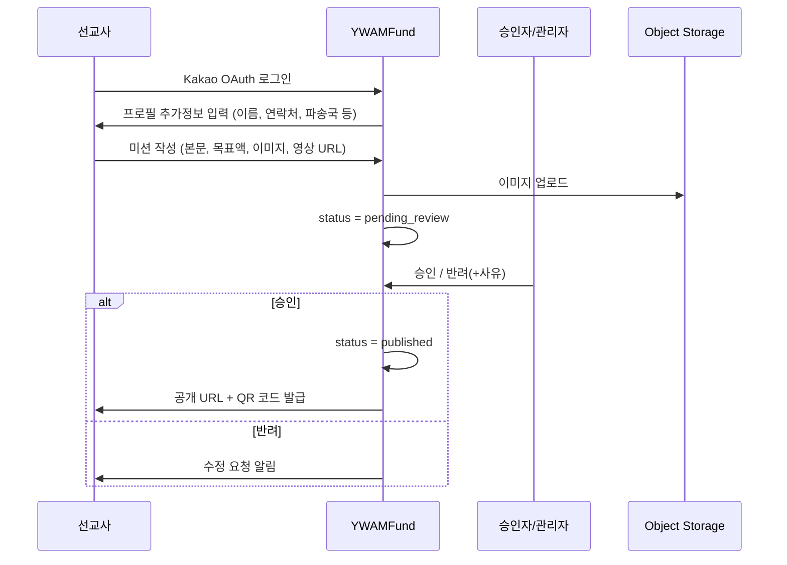
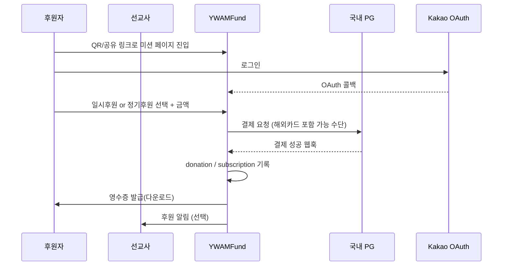

# 00. 요구사항 분석

## 1. 제품 정의

| 항목 | 내용 |
|------|------|
| **제품명(가칭)** | YWAMFund |
| **유형** | 미션(캠페인) 기반 후원 웹앱 |
| **레퍼런스** | [MissionFund.org](https://missionfund.org), [GoFundMe](https://www.gofundme.com/) |
| **핵심 가치** | 선교사가 미션을 올리고, 후원자가 QR/링크로 쉽게 정기·일시 후원 |
| **1차 시장** | 한국 내 결제(국내 PG), 해외카드 가능 |
| **언어** | 한국어(기본) · 영어 |

---

## 2. 사용자 역할 (Personas)

| 역할 | 코드 | 설명 | 가입 |
|------|------|------|------|
| **후원자 (Donor)** | `donor` | 미션에 일시/정기 후원, 영수증 다운로드 | Kakao OAuth |
| **선교사 (Missionary)** | `missionary` | 미션 등록·모금 현황·후원자 관리·메시지 | Kakao OAuth + 프로필 추가정보 |
| **승인자 (Approver)** | `approver` | 미션 승인/반려 (관리자 하위 또는 동일) | 관리자 지정 |
| **최종 관리자 (Admin)** | `admin` | 전체 현황·세계지도·사용자·승인·정산 모니터링 | 내부 계정/초대 |

> 한 사용자가 선교사 + 후원자 역할을 **동시에** 가질 수 있어야 하는지 → [고객 질문 Q-11](./07_CUSTOMER_QUESTIONS.md)

---

## 3. 요구사항 ↔ 기능 매핑

| # | 요구사항 | 기능 모듈 | 우선순위 |
|---|----------|-----------|----------|
| 1 | 선교사 미션 등록 (텍스트·이미지·YouTube/Vimeo) | Mission CRUD + Media | P0 |
| 2 | 후원자 Kakao 로그인 + QR로 미션 접속 + 일시/정기후원 | Auth · QR · Payment | P0 |
| 3 | Phase 1: 국내 PG만, 해외카드 결제 가능 (+ 환율·수수료 UI 고지) | Payment (Toss 등) | P0 |
| 4 | 선교사 대시보드: 미션 개수 한도·미션별/전체 모금 현황 | Missionary Dashboard | P0 |
| 5 | 후원자 정보·금액 확인, 메일/메신저 메시지 | Donors · Messaging | P1 |
| 6 | 후원자 대시보드: 미션별 후원 현황 + 기부금 영수증 | Donor Dashboard · Receipt | P0 |
| 7 | 미션 승인 프로세스 후 공개 | Approval Workflow | P0 |
| 8 | 관리자 대시보드 + 세계지도(대륙/국가별 선교사 수) + 전체 모금 | Admin Dashboard · Map | P1 |
| 9 | 미션별 Q&A / 업데이트 | Mission Updates · Comments | P1 |
| 10 | 선교사 가입(Kakao) + 확장 가능한 프로필 필드 | Profile · Extensible schema | P0 |
| 11 | 선교사 자격 검증(서류 업로드 등 — 고객 확인 후 범위 확정) | Onboarding · Verification | P1 |
| 12 | 계정 탈퇴 및 개인정보 파기(법정 보존 의무와 정합) | Auth · Privacy | P0 |
| 13 | 아동 보호(세이프가딩): 콘텐츠 내 미성년자 초상·신원 마스킹 가이드 | Content Policy · Moderation | P1 |
| 14 | 소속 단체/파송기관 표현(필요 시 — 고객 확인 후) | Organization · Profile | P1 |

---

## 4. 핵심 사용자 플로우

### 4.1 선교사: 가입 → 미션 등록 → 승인 → 공개

### 4.2 후원자: QR/링크 → 로그인 → 후원 → 영수증

### 4.3 관리자: 승인 · 현황 · 지도

- 미션 승인 큐
- 전체/국가/대륙별 선교사 수·모금액
- 세계지도 시각화
- 사용자·정산·감사 로그

---

## 5. 비기능 요구사항 (추정)

| 구분 | 요구 | 비고 |
|------|------|------|
| **보안** | OAuth, HTTPS, RLS/권한 게이트, 결제 웹훅 서명 검증 | TheSentAsset `requireAuth` 패턴 |
| **개인정보** | 후원자·선교사 PII 최소화·암호화·접근 감사·탈퇴/파기 | 고객 법적 주체·보존기간 확인 필요 |
| **컴플라이언스** | 기부금품 모집 등록·전자금융업 해당 여부 법무 확인 | [06 T-24~T-25](./06_OPEN_QUESTIONS.md), [07 Q-07](./07_CUSTOMER_QUESTIONS.md) |
| **i18n** | ko / en, URL `as-needed` | next-intl |
| **가용성** | VPS(PM2) 또는 매니지드 배포 · DB 일일 백업+PITR | TheSentAsset Linode 패턴 재사용 가능 |
| **감사** | 승인·결제·프로필 변경 audit log | TheSentAsset audit 패턴 |
| **성능** | 공개 미션 페이지 SSR/캐시(예: 60s revalidate), 대시보드 force-dynamic | |
| **관측** | Sentry(또는 동급) + 결제 API 레이트리밋 | Phase 1 필수 |

---

## 6. 범위 밖 (Phase 1 제외 후보)

- 해외 PG(Stripe 단독 등) — Phase 2+
- 앱 네이티브(iOS/Android)
- 실시간 채팅(카카오톡 API 직접 메시지) — 우선 이메일 + 앱 내 메시지
- 다통화 정산(원화 외 정산 통화)
- 크라우드펀딩 보상형(리워드) 캠페인

→ 확정은 [07_CUSTOMER_QUESTIONS.md](./07_CUSTOMER_QUESTIONS.md) 참고

---

## 7. 성공 지표 (제안)

| 지표 | 설명 |
|------|------|
| 미션 승인→첫 후원까지 시간 | 온보딩·UX 품질 |
| 정기 후원 유지율 | 빌링 안정성 |
| 정기결제 실패율 | 빌링·재시도 정책 품질 |
| 모바일 트래픽 대비 후원 전환율 | 모바일 UX·결제 퍼널 |
| 영수증 다운로드 성공률 | 세무 UX |
| 미션당 평균 후원자 수 | 공유/QR 효과 |
| 관리자 승인 SLA | 운영 품질 |
