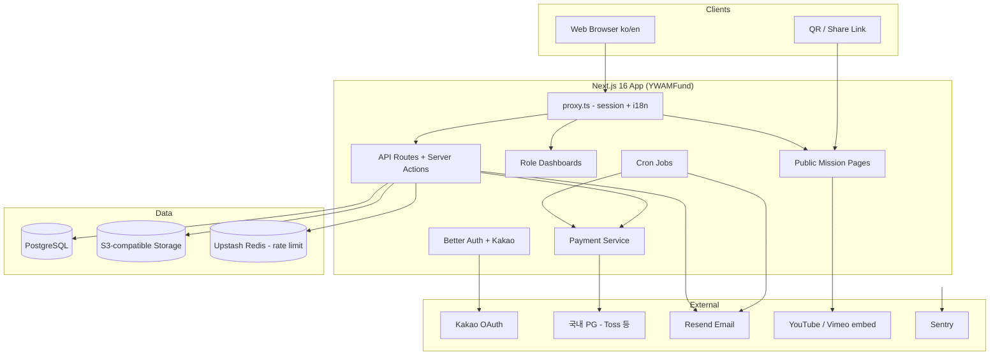

# 02. 시스템 아키텍처

## 1. 전체 구성도



---

## 2. 도메인 경계

| 도메인 | 책임 | 주요 테이블 |
|--------|------|-------------|
| **Identity** | 가입, OAuth, 세션, 역할 | `user`, `session`, `account`, `user_roles` |
| **Profile** | 선교사/후원자 확장 프로필 | `missionary_profiles`, `donor_profiles`, `profile_field_defs` |
| **Mission** | 미션 CRUD, 미디어, 승인 | `missions`, `mission_media`, `mission_approvals` |
| **Donation** | 일시/정기 후원, 환불, 웹훅 | `donations`, `subscriptions`, `billing_keys`, `refunds`, `webhook_events` |
| **Receipt** | 기부금 영수증 발급 | `donation_receipts` |
| **Messaging** | 앱 내 메시지, 이메일 발송, 수신거부 | `messages`, `notification_emails`, `notification_preferences` |
| **Engagement** | 업데이트, Q&A, 신고 | `mission_updates`, `mission_comments`, `content_reports` |
| **Organization** | 소속 단체/파송기관 (고객 확인 후) | `organizations` |
| **Admin Analytics** | 지도·집계 | 뷰/집계 쿼리 + `countries` |
| **Audit** | 감사 로그 | `audit_logs` |

---

## 3. 권한 모델

```
admin
  ├─ 모든 리소스 R/W
  ├─ 미션 승인
  └─ 집계·지도·사용자 관리

approver (optional, admin 하위)
  └─ 미션 승인/반려만

missionary
  ├─ 본인 프로필 R/W
  ├─ 본인 미션 CRUD (한도 내)
  ├─ 본인 미션 후원자·금액 R
  ├─ 본인 미션 메시지 발송
  └─ 본인 미션 updates/Q&A

donor
  ├─ 본인 후원 내역 R
  ├─ 영수증 다운로드
  ├─ 미션 Q&A 참여
  └─ 후원 생성 (본인)
```

서버사이드: `requireAuth()` + `requireRole('missionary' | 'admin' | …)`  
공개: 승인된(`published`) 미션만 비로그인 조회 가능.

---

## 4. 결제 아키텍처 (Phase 1)

### 4.1 일시후원

1. 클라이언트: 금액·미션 선택 → 서버 `createDonationOrder`
2. 토스(또는 선택 PG) 결제창 / 위젯
3. success URL → 서버 승인 API 호출
4. 웹훅으로 최종 확정 (멱등 키: `orderId`)
5. `donations.status = succeeded` → 영수증 레코드 생성

### 4.2 정기후원

1. 빌링키 발급 (카드/계좌 — PG 정책에 따름)
2. `subscriptions` 저장: 주기(월), 금액, `billingKey`, `nextChargeAt`
3. Cron이 당일 대상 조회 → 자동결제 API
4. 성공/실패 기록, 실패 시 재시도·후원자 알림

> 간편결제(카카오페이 등) 정기 지원 여부는 PG 상품별로 다름.  
> 토스 자동결제는 **신용·체크카드·계좌이체** 중심. 고객과 수단 범위를 합의해야 함.

### 4.3 해외카드

- 국내 PG의 **해외카드(Visa/MC 등) 결제 가능 옵션**을 계약 시 활성화
- Phase 1에서는 **정산 통화 KRW** 가정
- 환율·해외 수수료 안내는 UI에 고지

### 4.4 웹훅 신뢰성 · 정산 대사

| 항목 | 정책(초안) |
|------|------------|
| **원본 보관** | PG 웹훅 payload를 `webhook_events`에 저장 (`provider`, `payload`, `status`, `received_at`) |
| **멱등** | `orderId` / `paymentKey` 기준 중복 처리 방지 |
| **재시도** | 처리 실패 시 재시도 + 데드레터(수동 재처리). 관리자 Payments 콘솔에서 재실행 |
| **순서 역전** | 상태 전이 규칙을 단방향으로 두고, 이미 최종 상태면 무시·로그만 남김 |
| **정산 대사** | 일일 cron: PG 정산 API/파일 ↔ 내부 `donations`(succeeded) 대조, 불일치 알림 |

### 4.5 정기후원 실패 · 자동 해지

- 기본안: **3회 연속 실패**(각 약 3일 간격 재시도) → `subscriptions.status = paused` + 후원자 이메일 알림  
- 유예기간·자동 `canceled` 전환 여부는 고객 확인 ([07 Q-58](./07_CUSTOMER_QUESTIONS.md))

---

## 5. 미디어 전략

| 유형 | 저장 | 표시 |
|------|------|------|
| 이미지 | S3-compatible | Next/Image + CDN 캐시 (또는 signed URL) |
| YouTube / Vimeo | URL만 DB 저장 | oEmbed / iframe (화이트리스트 도메인) |
| 직접 동영상 업로드 | Phase 1 **제외** (용량·인코딩 비용) | — |

---

## 6. QR · 공유

- 미션 공개 URL: `https://{host}/m/{publicSlug}` 또는 `/missions/{id}`
- QR: `react-qr-code`로 동일 URL 렌더 + PNG 다운로드
- UTM/캠페인 파라미터 선택 지원
- TheSentAsset `asset-qr-display` 패턴 재사용

---

## 7. i18n

- `next-intl`, `locales: ['ko','en']`, `defaultLocale: 'ko'`, `localePrefix: 'as-needed'`
- 공개 미션: `title`/`body`는 **작성 언어 그대로** 저장 + 선택적 `title_en` 등 (고객 확인)
- UI 크롬만 필수 이중언어; 사용자 생성 콘텐츠 번역은 Phase 정책으로 분리

---

## 8. 캐싱 · 읽기 부하

| 대상 | 전략(초안) |
|------|------------|
| 공개 미션 페이지 | ISR/캐시 `revalidate` ≈ 60초 |
| 집계 뷰(지도·모금액) | 짧은 TTL 캐시 또는 materialized view; 초기엔 인덱스/뷰 |
| 결제·대시보드 | `force-dynamic`, 캐시 금지 |
| 트래픽 증가 시 | 읽기 전용 DB replica 검토 (Phase 2+) |

---

## 9. PII 암호화 범위 (초안)

| 컬럼/데이터 | 암호화 | 비고 |
|-------------|--------|------|
| `donor_profiles.receipt_identity_hint` | 앱 레벨 AES(또는 KMS) + `enc_version` | 주민번호 등 — 수집 시만 |
| `billing_keys.billing_key` | 앱 레벨 암호화 | PCI: 카드번호 직접 저장 금지 |
| 주소·전화번호 | 전송 TLS + DB 접근 통제; 필요 시 컬럼 암호화 | 노출 최소화 |
| `webhook_events.payload` | 민감필드 마스킹 후 저장 | 원본 재처리용 |
| 결제·기부 원장 | **하드 삭제 금지** (법정 보존) | 탈퇴 시 PII 익명화 |

키 관리: ENV/시크릿 스토어. 로테이션 시 `enc_version`으로 재암호화 배치.

---

## 10. 배포 토폴로지 (제안)

```
Internet → Nginx (TLS) → Next.js (PM2 cluster)
                ↓
         PostgreSQL (같은 VPS 또는 Managed, 일일 백업+PITR)
         Object Storage (Linode Objects / MinIO)
         Cron: curl -H "Authorization: Bearer $CRON_SECRET" /api/cron/...
```

TheSentAsset 배포 가이드(`KCPC_DEPLOY_GUIDE_LINODE_*`)를 포팅한다.
