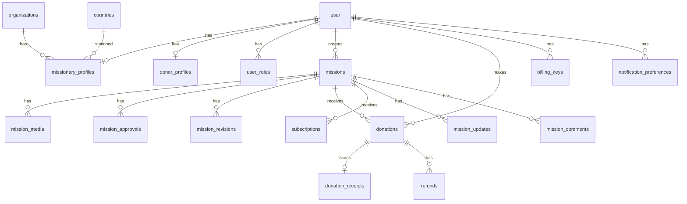

# 03. 데이터 모델 초안 (Drizzle / PostgreSQL)

> UUID PK, `created_at` / `updated_at`, 사용자 생성 콘텐츠는 `deleted_at`(soft-delete).  
> **결제·기부 원장(`donations` 등)은 법정 보존을 위해 하드 삭제 금지** — 탈퇴 시 PII 익명화.  
> Better Auth 기본 테이블(`user`, `session`, `account`, `verification`)은 라이브러리 스키마를 따른다.  
> PII 암호화: 앱 레벨 AES(또는 KMS) + `enc_version` 컬럼. 방식은 [02 §9](./02_SYSTEM_ARCHITECTURE.md) 참고.

---

## 1. ER 개요



---

## 2. 역할 · 프로필

### `organizations` (선택 — 고객 확인 후 도입)

소속 단체·파송교회·선교기관. Phase 1에서 개인 선교사만이면 생략 가능.

| 컬럼 | 타입 | 설명 |
|------|------|------|
| id | uuid PK | |
| name | text | |
| type | enum `sending_org` \| `church` \| `other` | |
| contact_email | text nullable | |
| contact_phone | text nullable | |
| country_code | char(2) nullable | |
| extra | jsonb | |
| created_at / updated_at | timestamptz | |

### `user_roles`

| 컬럼 | 타입 | 설명 |
|------|------|------|
| id | uuid PK | |
| user_id | uuid FK → user | |
| role | enum: `donor` \| `missionary` \| `approver` \| `admin` | |
| created_at | timestamptz | |

UNIQUE(`user_id`, `role`)

### `missionary_profiles`

| 컬럼 | 타입 | 설명 |
|------|------|------|
| user_id | uuid PK/FK | |
| organization_id | uuid FK nullable → organizations | 소속 단체 (선택) |
| display_name | text | |
| phone | text | |
| mobile | text | |
| emergency_contact_name | text | |
| emergency_contact_phone | text | |
| address_line1 | text | |
| address_line2 | text | |
| city | text | |
| postal_code | text | |
| country_code | char(2) | 거주/연락 국가 |
| field_country_code | char(2) | **선교 파송 국가** |
| residence_started_on | date | 거주 시작 |
| residence_ended_on | date nullable | |
| bio | text | |
| avatar_url | text | |
| verification_status | enum `none` \| `pending` \| `verified` \| `rejected` | 자격 검증 (고객 확인 후) |
| verification_docs | jsonb nullable | 서류 메타(스토리지 키 등) |
| max_active_missions | int | 기본값: 시스템 설정 |
| onboarding_completed_at | timestamptz | |
| extra | jsonb | **향후 필드 확장** |
| created_at / updated_at | timestamptz | |

### `donor_profiles`

| 컬럼 | 타입 | 설명 |
|------|------|------|
| user_id | uuid PK/FK | |
| display_name | text | |
| phone | text nullable | |
| receipt_name | text | 영수증 명의 |
| receipt_identity_hint | text encrypted/nullable | 주민번호 등 — **앱 레벨 암호화** |
| enc_version | smallint nullable | 암호 키 버전 |
| email_for_receipt | text | Kakao 이메일과 다를 수 있음 |
| extra | jsonb | |
| created_at / updated_at | timestamptz | |

### `profile_field_defs` (확장 메타 — 선택)

관리자가 “향후 추가 필드”를 UI로 정의할 때 사용.

| 컬럼 | 설명 |
|------|------|
| id, scope(`missionary`\|`donor`), key, label_ko, label_en, field_type, required, sort_order, active | |

값은 `*_profiles.extra` jsonb에 저장.

### `countries`

| 컬럼 | 설명 |
|------|------|
| code | ISO 3166-1 alpha-2 PK |
| name_ko / name_en | |
| continent_code | `AF` `AS` `EU` `NA` `SA` `OC` `AN` |

---

## 3. 미션

### `missions`

| 컬럼 | 타입 | 설명 |
|------|------|------|
| id | uuid PK | |
| missionary_user_id | uuid FK | |
| public_slug | text UNIQUE | QR/공유용 |
| title | text | |
| summary | text | |
| body | text | Markdown 또는 rich text |
| goal_amount_krw | numeric(14,0) | 목표액 (nullable = 목표 없음) |
| currency | text default `KRW` | |
| status | enum | `draft` \| `pending_review` \| `published` \| `rejected` \| `archived` \| `completed` |
| rejected_reason | text | |
| published_at | timestamptz | |
| cover_image_key | text | S3 key |
| youtube_url | text | |
| vimeo_url | text | |
| locale | text | 작성 언어 `ko`/`en` |
| deleted_at | timestamptz nullable | soft-delete |
| created_at / updated_at | timestamptz | |

인덱스: `(status, published_at)`, `(missionary_user_id, status)`

### `mission_media`

| 컬럼 | 설명 |
|------|------|
| id, mission_id, kind(`image`), storage_key, sort_order, alt_text, deleted_at | |

### `mission_approvals`

| 컬럼 | 설명 |
|------|------|
| id, mission_id, reviewer_user_id, action(`approve`\|`reject`), comment, created_at | |

TheSentAsset 구매승인 스냅샷보다 **단순 1단계**로 시작, 필요 시 다단계 확장.

### `mission_revisions`

공개 후 중요 필드 변경 시 재승인용. 승인자가 변경분(diff)만 검토.

| 컬럼 | 설명 |
|------|------|
| id, mission_id, submitted_by, diff jsonb, status(`pending`\|`approved`\|`rejected`), submitted_at, reviewed_at, reviewer_user_id | |

---

## 4. 후원 · 결제

### `donations` (일시 + 정기 청구분 모두)

| 컬럼 | 타입 | 설명 |
|------|------|------|
| id | uuid PK | |
| mission_id | uuid FK | |
| donor_user_id | uuid FK | |
| subscription_id | uuid nullable FK | 정기면 연결 |
| type | enum `one_time` \| `recurring_charge` | |
| amount_krw | numeric(14,0) | |
| status | enum `pending` \| `succeeded` \| `failed` \| `canceled` \| `refunded` | |
| pg_provider | text | `toss` 등 |
| pg_order_id | text UNIQUE | 멱등 |
| pg_payment_key | text | |
| pg_raw | jsonb | 응답 스냅샷(민감정보 제외) |
| is_anonymous | boolean | 후원자 공개명 숨김 |
| message_to_missionary | text | |
| paid_at | timestamptz | |
| created_at | timestamptz | |

> **하드 삭제 금지.** 회원 탈퇴 시 `donor_user_id` 익명화·PII 제거만 수행.

### `subscriptions`

| 컬럼 | 설명 |
|------|------|
| id, mission_id, donor_user_id | |
| amount_krw | |
| interval | `monthly` (Phase 1) |
| status | `active` \| `paused` \| `canceled` \| `past_due` |
| billing_key_id | FK |
| next_charge_at | |
| last_charged_at | |
| consecutive_failures | int default 0 |
| cancel_at / canceled_at | |
| created_at / updated_at | |

### `billing_keys`

| 컬럼 | 설명 |
|------|------|
| id, donor_user_id, pg_provider, customer_key, billing_key (encrypted), enc_version, card_last4, card_brand, status | |

### `webhook_events`

| 컬럼 | 타입 | 설명 |
|------|------|------|
| id | uuid PK | |
| provider | text | `toss` 등 |
| event_type | text | |
| idempotency_key | text | orderId/paymentKey 등 |
| payload | jsonb | 민감필드 마스킹 |
| status | enum `received` \| `processed` \| `failed` \| `ignored` | |
| error_message | text nullable | |
| received_at | timestamptz | |
| processed_at | timestamptz nullable | |

UNIQUE(`provider`, `idempotency_key`) — 중복 웹훅 방어

### `refunds`

| 컬럼 | 타입 | 설명 |
|------|------|------|
| id | uuid PK | |
| donation_id | uuid FK | |
| amount_krw | numeric(14,0) | 부분환불 가능 |
| reason | text | |
| approved_by | uuid FK → user | |
| pg_refund_key | text nullable | |
| refunded_at | timestamptz | |
| created_at | timestamptz | |

### `donation_receipts`

| 컬럼 | 설명 |
|------|------|
| id, donation_id UNIQUE | |
| receipt_no | 채번 규칙(고객 확인) |
| issued_at | |
| pdf_storage_key | |
| recipient_name | |
| amount_krw | |
| revision | int default 1 | 정정·재발행 시 증가 |
| superseded_by | uuid nullable FK → donation_receipts | |
| meta | jsonb (단체명, 사업자번호 등 스냅샷) |

---

## 5. 소통 · 참여

### `mission_updates`

선교사가 올리는 현황 업데이트 (공개/후원자만).

| 컬럼 | 설명 |
|------|------|
| id, mission_id, author_user_id, title, body, visibility(`public`\|`donors`), deleted_at, created_at | |

### `mission_comments` (Q&A)

| 컬럼 | 설명 |
|------|------|
| id, mission_id, author_user_id, parent_id nullable, body, status(`visible`\|`hidden`), deleted_at, created_at | |

### `content_reports`

| 컬럼 | 설명 |
|------|------|
| id, reporter_user_id, target_type(`comment`\|`update`\|`mission`), target_id, reason, status(`open`\|`resolved`\|`dismissed`), created_at, resolved_at | |

### `messages`

선교사 ↔ 후원자 1:1 (또는 선교사 → 다수 브로드캐스트는 별도).

| 컬럼 | 설명 |
|------|------|
| id, mission_id nullable, from_user_id, to_user_id, channel(`in_app`\|`email`), subject, body, sent_at, read_at | |

### `notification_preferences`

| 컬럼 | 설명 |
|------|------|
| id, user_id, channel(`email`\|`in_app`), category(`donation`\|`message`\|`marketing`\|…), opted_out boolean, updated_at | |

UNIQUE(`user_id`, `channel`, `category`)

---

## 6. 시스템

### `system_settings`

| key | 예시 value |
|-----|------------|
| `default_max_active_missions` | `3` |
| `org_legal_name` | … |
| `org_business_no` | … |
| `receipt_prefix` | `YF-2026-` |
| `subscription_max_failures` | `3` |

### `audit_logs`

actor_user_id, action, entity_type, entity_id, payload jsonb, ip, created_at

---

## 7. 집계 뷰 (예시)

```sql
-- 국가별 선교사 수 (관리자 지도)
CREATE VIEW v_missionary_count_by_country AS
SELECT field_country_code AS country_code, COUNT(*) AS missionary_count
FROM missionary_profiles
GROUP BY field_country_code;

-- 미션별 모금액
CREATE VIEW v_mission_raised AS
SELECT mission_id,
       COALESCE(SUM(amount_krw) FILTER (WHERE status = 'succeeded'), 0) AS raised_krw,
       COUNT(*) FILTER (WHERE status = 'succeeded') AS donation_count
FROM donations
GROUP BY mission_id;
```

---

## 8. 확장성 원칙

1. **고정 컬럼** = 자주 조회·필터·인덱스 필요한 필드 (파송국, 전화번호 등)  
2. **`extra` jsonb** = 드물거나 고객사마다 다른 필드  
3. 필요 시 `profile_field_defs`로 관리자 UI 확장  
4. 금액은 **원(KRW) 정수**로 저장 (소수점 수수료는 PG 메타에)  
5. 사용자 콘텐츠: `deleted_at` soft-delete / 결제 원장: 하드 삭제 금지·익명화  
6. `organizations`·팀 단위 모금은 고객 확인 후 활성화
