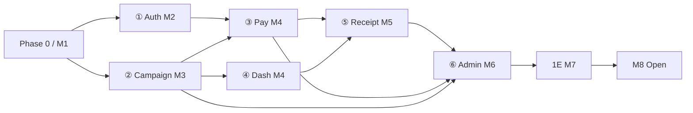

# 05. 단계별 개발 로드맵

> **고객 계약 일정(SSOT):** [13_CUSTOMER_SCHEDULE_MILESTONE_v7.md](./13_CUSTOMER_SCHEDULE_MILESTONE_v7.md)  
> **원본:** `doc/reference/YWAMKoreaFund_세부일정_마일스톤_v7.docx` (2026-08)  
> **개정:** 2026-08-09 — v7 캘린더·범위 반영

고객 확인([07](./07_CUSTOMER_QUESTIONS.md))이 끝나기 전에도 **Phase 0 / D0~D1** 선행은 가능하며, **정식 착수는 M1 = 2026-09-11**.

---

## 고객 일정 요약 (v7)

| 마일스톤 | 일자 | 내용 |
|----------|------|------|
| **M1** | 2026-09-11 | 착수 · 요구사항·명단·양식·환경 |
| **M2** | 2026-10-15 | 로그인 데모 (카카오·**구글**, 선교사 명단 승인) |
| **M3** | 2026-10-22 | 캠페인 등록·승인 데모 (한도 3·아동보호 동의·SLA) |
| **M4** | 2026-11-12 | Toss 결제·환불 테스트 · 선교사·후원자 대시보드 |
| **M5** | 2026-12-03 | 영수증·국세청 제출 파일 회계 검수 ⭐ |
| **M6** | 2027-01-21 | 관리자 기능 전체 데모 |
| **M7** | 2027-02-11 | 통합·약관·PG 라이브 심사 |
| **M8** | 2027-02-12 | **정식 오픈** (`ywamkoreafund.org`) |

총 기간 약 **22주** · 제안 개발비 USD **$35,000** (지급: M1 30% / M5 40% / M8 30%).

인력: **개발1**(인증·결제·영수증·관리자 A) · **개발2**(캠페인·대시보드·관리자 B) · 테스터 · PM.

→ 상세 매핑: [13](./13_CUSTOMER_SCHEDULE_MILESTONE_v7.md)

---

## 범위 확정 (v7 반영)

| 포함 (Phase 1) | 제외 / 별도 |
|----------------|-------------|
| Kakao + **Google** OAuth · 선교사 명단 대조 | 선교사 **직접 송금** (1차 제외) |
| 캠페인 등록·**2단계 승인**(본부·선교본부) · 한도 3 · 아동보호 동의 | AI 아동 캐릭터화 · AI 자동번역 (**부가·과금 협의 후**) |
| Toss 일시·정기·환불 · (검토) 카카오페이 등 | Stripe — Phase 2 후보 |
| 후원자 영수증 · 국세청 파일 · **영문 영수증** | 선교사 기준 영수증 — ★ 문서 종류 확인 후 |
| 대시보드 · 관리자 8영역 · 감사로그 | “프로젝트” 유형 카테고리 — ★ 정의 확인 후 |
| 후원자 PII: 선교사에게 이름·금액만 (익명·연락처 비공개) | |

---

## Phase 0 — 기반 (선행 + M1 준비)

**목표:** 스택 부트스트랩 + i18n·Supabase + 문서·ENV·CI  
**현황:** D0·D1 핵심 **완료** ([09](./09_DEVELOPMENT_PHASES.md) · [logs](./logs/2026-07-24_DEV_LOG.md))  
**M1 구간(09-11~09-24):** 요구사항 최종 · 명단·국세청 양식 수령 · Toss 가맹 · 프로덕션 ENV·도메인

- [x] Next.js 16 · Tailwind · Drizzle · next-intl · Supabase 연결
- [x] CI · message-key parity · Vitest
- [ ] Kakao + **Google** OAuth (Better Auth) — **M2 / D2-A**
- [ ] `user_roles` · 도메인 스키마 — D2
- [ ] Toss 테스트 키 · `PaymentProvider` — D2-C
- [ ] 선교사·간사 명단 수령 · 국세청 양식 수령

**DoD (M1 말):** 계약·명단·양식·가맹 진행 · 개발 ENV 준비 완료

---

## Phase 1A — 미션 · 승인 · 공개 (≈ M2~M3, ~4주)

- [ ] 선교사 온보딩 · **명단 대조 승인**
- [ ] 미션 CRUD, 이미지, YouTube/Vimeo · **활성 3개 한도**
- [ ] 승인 워크플로 **2단계** + **1주 SLA** + 반려 사유
- [ ] 아동보호 동의 문구
- [ ] 공개 `/m/[slug]` + QR (D1 mock → DB)

**DoD:** M3 — 등록→승인→공개 데모

---

## Phase 1B — 결제 · 후원 · 대시보드 (≈ M4, ~4주) ⭐

- [ ] Toss 카드/계좌 · 일시·정기 · 웹훅 · 환불
- [ ] (확인 후) 카카오페이 등 간편결제
- [ ] 정기 실패 재시도·일시정지
- [ ] 선교사·후원자 대시보드 실데이터
- [ ] 후원자 PII 정책 적용 (이름·금액만 / 익명)

**DoD:** M4 — 샌드박스 결제·환불 E2E + 대시보드 데모

---

## Phase 1C — 영수증 · 메시지 · Q&A (≈ M5, ~3주)

- [ ] 기부금 영수증 PDF (연간합산·건별·**영문**)
- [ ] **국세청 제출 파일** — 회계 최종 검수 ⭐
- [ ] 앱 내 메시지 + Resend (연락처 비공개 전제)
- [ ] 미션 업데이트 · Q&A
- [ ] 계정 탈퇴·PII 익명화
- [ ] (★확정 시) 선교사 기준 영수증

**DoD:** M5 — 회계 담당 국세청 파일 검수 통과

---

## Phase 1D — 관리자 · 지도 (≈ M5~M6)

- [ ] ⑥-A: 결제 실패/환불 모니터 · 감사 로그 · 시스템 설정
- [ ] ⑥-B: 승인 워크플로 · 세계지도 · 집계 CSV/Excel · 사용자·권한(본부/선교본부)
- [ ] (★확정 시) 프로젝트 유형·사역 분야 카테고리

**DoD:** M6 — 관리자 8영역 데모

---

## Phase 1E — 보안·법률·PG 라이브 (≈ M7)

- [ ] 통합 시나리오 · 보안 점검
- [ ] 약관·개인정보처리방침 최종
- [ ] Toss **라이브** 심사 · 실결제 테스트
- [ ] 기부금품모집법·전자금융업 법무 결과 반영

**DoD:** M7 — 라이브 심사·약관 완료

---

## Phase 1F / 오픈 — (≈ M8)

- [ ] 온보딩 안내 · 실 서비스 배포 (`ywamkoreafund.org`)
- [ ] (선택) 단기 베타를 M7 구간에 압축 운영

**DoD:** M8 — 정식 오픈 2027-02-12

---

## Phase 2 — 강화 (오픈 이후 / 부가 트랙)

- Stripe 국제 결제 (후보)
- 카카오 알림톡
- **AI 자동번역 · AI 아동 캐릭터화** (비용 정책 확정 후 별도 일정)
- 선교사 직접 송금 (운영 경험 후 재검토)
- 다통화·팀/단체 모금 · 환불 셀프서비스 등

---

## 의존성

---

## 인력·일정

| 구간 | 고객 캘린더 | 내부 공수 감각 |
|------|-------------|----------------|
| 준비·Auth·캠페인 | M1~M3 (≈6주) | 개발1∥개발2 |
| 결제·대시 | ~M4 (+≈3주) | 개발1∥개발2 |
| 영수증·관리자 | M5~M6 (≈7주) | 개발1∥개발2 + 테스터 |
| 통합·오픈 | M7~M8 (≈3주) | 전체 |
| **합계** | **M1→M8 ≈ 22주** | 디자인·법무·회계 검수 별도 |

상세 작업 ID: [09](./09_DEVELOPMENT_PHASES.md) · 고객 매핑: [13](./13_CUSTOMER_SCHEDULE_MILESTONE_v7.md)
