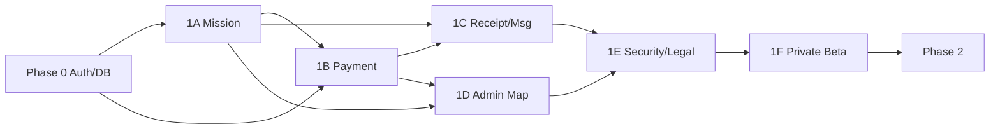

# 05. 단계별 개발 로드맵

고객 확인([07](./07_CUSTOMER_QUESTIONS.md))이 끝나기 전에도 **Phase 0**은 진행 가능하다.

---

## Phase 0 — 기반 (1~2주)

**목표:** TheSentAsset 스택 부트스트랩 + **i18n·로컬 DB** + 문서·ENV·CI

- [ ] Next.js 16 · Tailwind 4 · Drizzle · Better Auth · **next-intl (`ko`/`en`) 스캐폴딩**
- [ ] **Docker Compose Postgres** (개발 표준) + `DATABASE_URL`
- [ ] Kakao OAuth 개발 앱 등록·콜백 연동
- [ ] `user_roles`, profile 스키마 마이그레이션
- [ ] 기본 셸: `[locale]` marketing / login / dashboard layout
- [ ] S3 업로드 헬퍼 포팅
- [ ] CI: lint, typecheck, **message-key parity**, vitest
- [ ] Sentry + 결제 API용 Upstash 레이트리밋 스캐폴딩
- [ ] `doc/ENV_YWAMFUND_PHASE0.md` 작성
- [ ] DB 백업·PITR · **호스팅 = Supabase ✅** ([10](./10_I18N_DB_PAYMENTS.md); VPS 대안은 문서 이력)
- [ ] 결제: **Toss ✅** 테스트 키 · `PaymentProvider` 초안 (Stripe는 D5 후보)

**DoD:** Docker DB + Kakao 로그인 → 세션 → ko/en 전환 → 마이그레이션 동작

→ 작업 ID 상세: [09 D0~D2](./09_DEVELOPMENT_PHASES.md)
---

## Phase 1A — 미션 · 승인 · 공개 (2~3주)

- [ ] 선교사 온보딩 폼 (확장 가능 `extra`)
- [ ] 미션 CRUD, 이미지, YouTube/Vimeo
- [ ] 승인 워크플로 (1단계)
- [ ] 공개 미션 페이지 + QR
- [ ] 미션 개수 한도

**DoD:** 승인된 미션이 공개 URL/QR로 열림

---

## Phase 1B — 결제 · 후원 (3~4주) ⭐ 핵심

- [ ] PG 계약·테스트 키 (고객)
- [ ] 일시후원 (해외카드 포함 수단) + 환율·수수료 UI 고지
- [ ] 정기후원 빌링키 + cron 청구
- [ ] donations / subscriptions / webhook 멱등 + `webhook_events`
- [ ] 정기 실패 재시도·3회 후 자동 일시정지
- [ ] 선교사: 미션별·전체 모금 현황
- [ ] 후원자: 후원 현황
- [ ] (해당 시) 기존 후원자·선교사 명단 이관

**DoD:** 테스트 환경에서 일시·정기 성공·실패 시나리오 E2E

---

## Phase 1C — 영수증 · 메시지 · Q&A (2주)

- [ ] 기부금 영수증 PDF (법적 문구는 고객 확정본) + 정정·재발행
- [ ] 앱 내 메시지 + Resend + 수신거부
- [ ] 미션 업데이트 · Q&A · 콘텐츠 신고
- [ ] 계정 탈퇴·PII 익명화 플로우

**DoD:** 후원자가 영수증 다운로드, 선교사가 후원자에게 메일 발송, 탈퇴 시 원장 보존

---

## Phase 1D — 관리자 · 지도 (2주)

- [ ] 승인 큐, 사용자·한도 설정, revision 검토
- [ ] 세계지도 + 대륙/국가 선교사 수
- [ ] 전체 모금 집계·기간 필터
- [ ] Payments: 환불·웹훅 재처리·정산 대사 리포트
- [ ] audit log 뷰

**DoD:** 관리자가 지도·모금·승인·결제 운영을 한 대시보드에서 처리

---

## Phase 1E — 보안·법률·PG 라이브 (1~2주)

- [ ] 보안 점검(웹훅·PII·권한·시크릿)
- [ ] PG 라이브 심사·계약 최종
- [ ] 약관·개인정보처리방침·아동 보호 가이드 반영
- [ ] 기부금품모집법·전자금융업 해당 여부 법무 확인 결과 반영 ([06 T-24~T-25](./06_OPEN_QUESTIONS.md))

**DoD:** 라이브 결제 가능 + 법무/약관 체크리스트 통과

---

## Phase 1F — 비공개 베타 (1~2주)

- [ ] 초대된 소수 선교사·후원자 실사용 ([07 Q-102](./07_CUSTOMER_QUESTIONS.md))
- [ ] 결제·영수증·승인 SLA 피드백 반영
- [ ] 정식 공개 전 이슈 트리아지

**DoD:** 베타 피드백 반영 후 공개 오픈 결정

---

## Phase 2 — 강화 (이후)

- **Stripe 국제 결제** (후보 · `StripeProvider`, [09 D5](./09_DEVELOPMENT_PHASES.md) · [10](./10_I18N_DB_PAYMENTS.md) — Phase 1은 Toss만)
- 카카오 알림톡
- 다단계 승인 / 콘텐츠 재승인 정책 고도화
- 환불 셀프서비스
- 다통화 표시·정산 고도화
- 미션 검색·카테고리·추천
- 영문 미션 자동번역(선택)
- PWA 푸시
- 읽기 전용 DB replica / 이미지 자동 모더레이션
- 팀·단체 단위 모금 페이지 (`organizations` 확장)

---

## 의존성

---

## 인력·일정 (러프)

| Phase | 공수(1풀스택 기준) | 병행 권장 |
|-------|-------------------|-----------|
| 0 | 1~2주 | — |
| 1A | 2~3주 | 디자인(랜딩·대시보드) |
| 1B | 3~4주 | PG 계약·심사(고객), QA 시나리오 |
| 1C | 2주 | 법무 약관 초안 |
| 1D | 2주 | — |
| 1E | 1~2주 | 법무·세무 최종 |
| 1F | 1~2주 | 베타 운영 |
| **합계** | **약 12~17주** | 디자인·QA·법무는 풀스택과 **별도 공수** |

기존 엑셀 등 명단 이관이 있으면 Phase 0~1A에 반영 ([07](./07_CUSTOMER_QUESTIONS.md)에서 확인).
