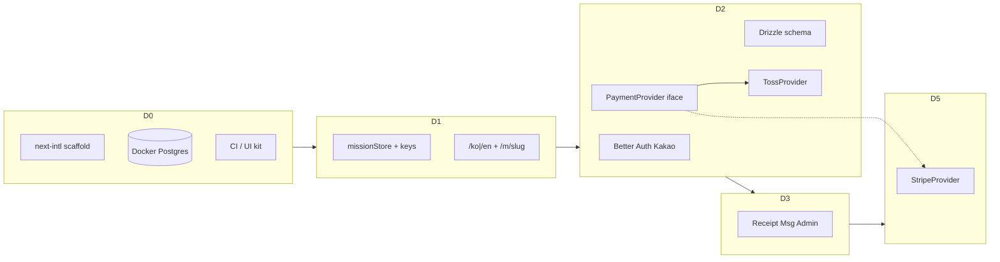
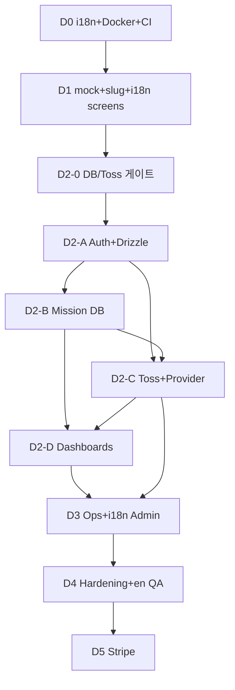

# 09. UI 기반 개발 단계 상세 (개발 관점)

> **기준:** 현재 워크스페이스 UI 프로토타입 (`app/`, `components/`)  
> **전제:** DB·Auth·실결제 미연동 — 화면·플로우는 존재  
> **플랫폼 결정:** [10](./10_I18N_DB_PAYMENTS.md) — **결제 Phase1=Toss · DB 호스팅=Supabase** (대안 비교는 10에 보존)  
> **관련:** [08](./08_UI_PROTOTYPE_PLAN.md) · [05](./05_PHASE_ROADMAP.md) · [04](./04_FEATURE_SPEC.md) · [03](./03_DATA_MODEL.md) · [01](./01_TECH_STACK.md)  
> **작성일:** 2026-07-21 · **개정:** 2026-07-21 (Toss·Supabase 확정 반영)  
> **독자:** 구현 담당 (프론트·풀스택)

---

## 0. 이 문서의 역할

| 문서 | 역할 |
|------|------|
| `05_PHASE_ROADMAP` | 일정·마일스톤·인력 |
| `08_UI_PROTOTYPE_PLAN` | 프로토타입 이식 개요 |
| `10_I18N_DB_PAYMENTS` | i18n / DB / 결제 **비교 이력 + 확정(Decision Log)** |
| **본 문서 (`09`)** | UI → 프로덕션 **작업 ID 단위 개발 단계** |

**원칙**

1. UI 컴포넌트 재사용 · mock → 데이터 계층 치환.  
2. **다국어 기반은 늦게 넣지 않는다** (D0부터 next-intl).  
3. **DB:** 로컬 = Docker Postgres · **스테이징/프로덕션 = Supabase Postgres** ([10](./10_I18N_DB_PAYMENTS.md) ✅). VPS Postgres는 검토 대안으로 문서에만 보존.  
4. **결제 Phase 1 = Toss** ✅ · `PaymentProvider`로 Stripe(D5 후보) 확장 자리 유지.  
5. 고객 미결(Q-07, Q-15, Q-55 등)은 단계 **블로커**로 명시.  
6. 계정·키·인프라 사전 준비는 [11_DEV_PREPARATION.md](./11_DEV_PREPARATION.md).

---

## 1. 현재 UI 베이스라인

### 1.1 구현되어 “보이는” 것

| 영역 | 경로 / 컴포넌트 | 동작 수준 |
|------|-----------------|-----------|
| 마케팅 홈 | `/` · `HomePage` | 배너·검색·필터·카드·마퀴 — **전부 mock** |
| 미션 상세 | `/mission` · `MissionPage` | 단일 고정 미션, 후원 모달 |
| 후원 UX | `DonationModal` | 4스텝 UI, 가짜 결제 |
| 후원자 / 선교사 / 생성 / FAQ / 관리자 | `/my` `/dashboard` `/create` `/support` `/admin` | mock·로컬 state |
| 배너 | `lib/bannerStore` | 동일 탭 세션만 동기화 |

### 1.2 의도적으로 없는 것 → 본 문서 단계로 채움

| 공백 | 채우는 단계 |
|------|-------------|
| next-intl · `[locale]` · ko/en 메시지 | **D0 → D1 → D3/D4** |
| Docker Postgres · Drizzle · **Supabase(스테이징/프로덕션)** | **D0(compose) → D2** |
| Better Auth · Kakao | **D2-A** |
| **Toss** 실결제 · 웹훅 · 빌링 | **D2-C** |
| PaymentProvider + Stripe 자리 (미도입) | **D2-C 인터페이스 · D5 후보** |
| `/m/[slug]` · QR · 미션 Q&A · 영수증 PDF | D1 / D3 |

### 1.3 코드 부채

| 부채 | 해소 |
|------|------|
| mock 중복 · `ignoreBuildErrors` · recharts 타입 | D0~D1 |
| 한국어 하드코딩 전역 | D1부터 신규 금지, D1~D4 추출 |
| Navbar 역할 혼재 | D2-D |
| `/support` ≠ 미션 Q&A | D3 |

---

## 2. 화면 × 특징 갭 매트릭스

| # | 특징 | 현재 UI | 필요 개발 | 단계 |
|---|------|---------|-----------|------|
| F01 | 공개 미션 목록 | ✅ | API + published + i18n 라벨 | D1→D2 |
| F02 | `/m/[slug]` | 🔶 | 동적 라우트 · OG · `[locale]` | D1 |
| F03 | QR · 공유 | 🔶 | react-qr-code | D1 |
| F04 | 배너 CMS | 🔶 | DB CRUD | D3 |
| F05~F06 | 생성·승인 | ✅ | mock store → DB | D1→D2 |
| F08~F09 | Kakao · 온보딩 | ❌ | Better Auth · roles | D2 |
| F10~F12 | 일시/정기/실패정책 | ✅모달 | **Toss** + webhook + cron | D2-C |
| F10b | 국제 결제 | ❌ | **Stripe** Provider (후보) | **D5** |
| F13~F16 | 대시보드 | ✅ | 실데이터 | D2-D |
| F14~F15 | 영수증 PDF·정정 | 🔶 | react-pdf · 다국어 템플릿 | D3 |
| F17~F19 | 메시지·Updates·Q&A | 🔶/❌ | Resend · comments | D3 |
| F22~F24 | 환불·대사·탈퇴 | ❌ | refunds · reconcile | D3 |
| F25 | **i18n ko/en 기반** | ❌ | next-intl 전 구간 | **D0~D4** |
| F29 | **로컬 Docker DB** | ❌ | compose + migrate | **D0·D2** |
| F30 | **호스팅 DB** | ❌ | **Supabase ✅ 확정** (VPS는 [10](./10_I18N_DB_PAYMENTS.md) 이력) | D2 |
| F28 | 조직/팀 모금 | 🔶 | organizations | D5 |

---

## 3. 목표 아키텍처 진화



**디렉터리 목표 (D1 말~D2)**

```
src/app/[locale]/(marketing|auth|dashboard)/...
messages/ko.json
messages/en.json
src/lib/db/          # Drizzle — DATABASE_URL → local Docker | Supabase
src/lib/payments/
  types.ts           # PaymentProvider
  toss.ts            # Phase 1 구현
  stripe.ts          # D5 후보 stub (비교·확장용, Phase 1 비활성)
  router.ts          # donorContext → provider
docker-compose.yml   # Postgres 16 (로컬만)
```

---

## 4. 개발 단계 상세

공수: **1풀스택 기준 러프**. 법무·PG 심사·디자인은 [05](./05_PHASE_ROADMAP.md) 별도.

---

### D0 — 엔지니어링 · i18n · 로컬 DB 기반 (4~7일)

**목표:** “다국어·DB·결제를 얹을 수 있는” 레포. 비즈니스 기능 최소.

| ID | 작업 | 산출물 / DoD |
|----|------|--------------|
| D0-1 | `ignoreBuildErrors` 제거 가능 수준으로 타입 정리 (recharts, maps) | `tsc --noEmit` 통과 |
| D0-2 | ESLint + Vitest 스모크 + CI | PR lint/typecheck |
| D0-3 | Sentry · rate-limit 훅 자리 · `doc/ENV_*.md` 초안 | ENV 목록에 DB/TOSS/STRIPE(예비)/i18n |
| D0-4 | `components/ui` 최소셋 (dialog, input, label, textarea, select, badge) | 폼 일관성 |
| **D0-5** | **next-intl 스캐폴딩** | `messages/ko.json`·`en.json` (nav, common 최소), `i18n/routing.ts`, 임시 `[locale]` 또는 root proxy 준비 |
| **D0-6** | **Locale switcher** (Navbar) | ko↔en URL 전환, 미번역은 키/한글 폴백 허용 |
| **D0-7** | **`docker-compose.yml` Postgres 16** | 로컬 개발 표준. 호스팅은 Supabase([10](./10_I18N_DB_PAYMENTS.md) ✅) |
| D0-8 | drizzle-kit 초기화 + **Supabase 프로젝트 생성·`DATABASE_URL` 스테이징 발급** | 로컬·Supabase 둘 다 migrate 가능한지 스모크 |
| D0-9 | `messages:check-keys` 스크립트 초안 | ko/en 키 집합 동일 |

**DoD**

- [ ] Docker Postgres 기동 · 연결 확인  
- [ ] `/`와 `/en` (또는 prefix 정책)에서 네비 일부 영문 전환  
- [ ] CI typecheck 통과  

**블로커:** 없음.  
**참고:** [10 §1](./10_I18N_DB_PAYMENTS.md), [10 §2](./10_I18N_DB_PAYMENTS.md)

---

### D1 — i18n 핵심 화면 · mock 도메인 · 라우트 (1.5~2.5주)

**목표:** 데모 가능한 제품 루프 + **UI 문자열의 상당 부분을 메시지 파일로**. DB 앱 CRUD는 아직 mock store.

| ID | 작업 | 상세 |
|----|------|------|
| D1-1 | `lib/mock/` 통합 | missions, donations, banners 단일 소스 |
| D1-2 | `missionStore` / `bannerStore` | create→approve→home 루프 (subscribe) |
| D1-3 | `/[locale]/m/[slug]` | 카드·CTA 연결, `generateMetadata` (locale별 title) |
| D1-4 | QR | 공개 URL(로케일 포함 정책 확정: 기본 ko URL 권장) |
| D1-5 | Create → pending_review mock | Admin 승인 탭 연동 |
| D1-6 | Admin 승인 → published | 홈 목록 반영 |
| D1-7 | 로그인 스텁 | 역할 데모 (실 OAuth 아님) |
| D1-8 | 모바일 nav | 햄버거 + locale 유지 |
| **D1-9** | **i18n 키 이관 (P0 화면)** | Home, Mission, DonationModal, Navbar, 공통 버튼/에러 |
| **D1-10** | **신규 문자열 하드코딩 금지** | PR 체크리스트 / ESLint `no-literal` 선택 |
| D1-11 | `/support` 라벨 → “고객지원” | 미션 Q&A와 구분 (카피만) |

**금액·날짜:** `useFormatter()`로 표시. 저장 단위는 여전히 KRW mock number.

**DoD**

- [ ] ko/en에서 홈·미션·후원 모달 주요 UI가 메시지 키 사용  
- [ ] create→approve→`/m/{slug}` 데모  
- [ ] `messages:check-keys` CI 통과  

**블로커:** 없음.

---

### D2 — Auth · DB 영속화 · Toss 결제 코어 (4~6주) ⭐

**목표:** 로컬 Docker + **Supabase(스테이징)** + Kakao + **Toss 실결제(테스트키)**.  
Stripe는 인터페이스/stub만 (D5 후보 — [10 §3](./10_I18N_DB_PAYMENTS.md) 비교 유지).

#### D2-0 게이트 (확정 반영 · 착수 체크)

| ID | 항목 | 상태 |
|----|------|------|
| D2-0-1 | 호스팅 DB = **Supabase** | ✅ 확정 — 스테이징/프로덕션 `DATABASE_URL` 발급 |
| D2-0-2 | Phase 1 PG = **Toss** 테스트 키 | ✅ 확정 — ENV 설정 |
| D2-0-3 | Stripe = D5 후보 · `pg_provider` 컬럼만 확보 | 도입 시점은 T-19 (미정) |
| D2-0-4 | (이력) VPS Postgres 대안 | 채택하지 않음 — [10 §2.1](./10_I18N_DB_PAYMENTS.md) |

#### D2-A 인프라 (약 1~1.5주)

| ID | 작업 |
|----|------|
| D2-A1 | Drizzle 스키마: Better Auth tables + `user_roles` — **로컬 Docker에 migrate** |
| D2-A2 | **동일 migrate → Supabase 스테이징** |
| D2-A3 | Kakao OAuth · 세션 · `requireAuth` / `requireRole` |
| D2-A4 | 앱 트리를 `src/app/[locale]/...`로 정렬 (D0/D1에서 미완 시 완료) |
| D2-A5 | 스토리지: S3-compatible **또는** Supabase Storage (추상화 유지) |
| D2-A6 | Supabase: Data API/`anon` 남용 금지, **service_role·DB URL은 서버만**, Auth/Realtime 미사용 |

#### D2-B 미션 영속화 (약 1~1.5주)

| ID | 작업 | UI |
|----|------|-----|
| D2-B1 | `missions`, `mission_media`, `mission_approvals` | Create, Admin |
| D2-B2 | Server Actions CRUD/submit/approve/reject | 동상 |
| D2-B3 | `getPublishedMissions`, `getMissionBySlug` | Home, `/m/[slug]` |
| D2-B4 | `/onboarding/missionary` 분리 + i18n 폼 라벨 | Create 단순화 |
| D2-B5 | `max_active_missions` 서버 검증 | Create |
| D2-B6 | mock store 제거 또는 `USE_MOCK=false` 기본 | — |

#### D2-C 결제 — Toss + Provider 추상화 (약 2주)

| ID | 작업 | UI |
|----|------|-----|
| **D2-C0** | **`PaymentProvider` 인터페이스** (`createOneTime`, `registerBilling`, `charge`, `refund`, `parseWebhook`) | — |
| **D2-C1** | **`TossProvider` 구현** + 테스트 키 위젯 | DonationModal |
| D2-C2 | confirm API + webhook + `webhook_events` | success = 확정 후 |
| D2-C3 | `donations` (`pg_provider='toss'`, 멱등 order id) | Feed, `/my` |
| D2-C4 | 빌링키 · `subscriptions` · cron charge | monthly |
| D2-C5 | 3회 실패 → paused + 이메일 (ko/en 템플릿 키) | `/my` |
| D2-C6 | KRW·수수료·환율 고지 (i18n) | Modal |
| D2-C7 | 로그인 강제 `?next=` | StickyDonateBar |
| **D2-C8** | **`StripeProvider` stub** (미구현 throw / feature flag off) | `PAYMENT_PROVIDERS_ENABLED=toss` |
| D2-C9 | Admin: 웹훅 실패 재처리 콘솔(최소) | Admin |

#### D2-D 대시보드 (병행 ~1주)

| ID | 작업 |
|----|------|
| D2-D1 | `/my` 실데이터 · 해지 · i18n |
| D2-D2 | `/dashboard` 집계 · PII 마스킹 |
| D2-D3 | Navbar role 필터 |

**스키마 최소:** [03](./03_DATA_MODEL.md) + `donations.pg_provider` · `billing_keys.pg_provider`

**DoD**

- [ ] 로컬 Docker에서 migrate → Kakao 로그인 → 미션 승인 → Toss 테스트 일시/정기 E2E  
- [ ] **Supabase 스테이징**에 동일 마이그레이션 적용  
- [ ] `PaymentProvider`로 **Toss만** 활성 (`PAYMENT_PROVIDERS_ENABLED=toss`), Stripe stub flag off  
- [ ] `/my`·`/dashboard` 수치 = DB  

**블로커:** Q-50~52(Toss 계약 세부), Q-55/T-25, Q-07/T-24(라이브), Q-70~71  
**(해소됨)** T-10 Toss · T-18 Supabase — [10 §0](./10_I18N_DB_PAYMENTS.md)

---

### D3 — 영수증 · 소통 · 관리 · i18n 확장 (2~3.5주)

| ID | 작업 | 비고 |
|----|------|------|
| D3-1 | 영수증 PDF | 템플릿 문구 `messages` 또는 `receipts` 네임스페이스 **ko/en** |
| D3-2 | 영수증 정정 | revision |
| D3-3 | mission_updates | |
| D3-4 | 미션 Q&A + content_reports | `/support`와 분리 |
| D3-5 | messages + Resend | 이메일 로케일 = 사용자 locale 또는 ko 기본 |
| D3-6 | banners 테이블 | bannerStore 대체 |
| D3-7 | 지도·KPI API | |
| D3-8 | 회원·한도·verification | |
| D3-9 | refunds (TossProvider.refund) | Stripe는 D5 |
| D3-10 | 정산 대사 cron (Toss 정산 파일/API) | |
| D3-11 | 탈퇴·익명화 | Q-15 |
| D3-12 | featured/urgent | |
| D3-13 | 아동 보호 카피 i18n | Q-38 |
| **D3-14** | **잔여 UI 키 이관** (Admin 대형 화면) | check-keys |
| D3-15 | DB 백업 검증 | 로컬 덤프 + **Supabase PITR/백업** 확인 |

**DoD:** PDF 다운로드(ko/en), Q&A, Admin 지도=DB, 탈퇴 익명화, Admin 주요 라벨 i18n

**블로커:** Q-03/60/63, Q-15, Q-38

---

### D4 — 하드닝 · i18n QA · 베타 (1~3주)

| ID | 작업 |
|----|------|
| D4-1 | 보안: 웹훅 서명, 권한, 업로드, XSS sanitize |
| D4-2 | a11y ([04 §13](./04_FEATURE_SPEC.md)) · `lang`·스크린리더 라벨 양 언어 |
| **D4-3** | **영문 UX QA** — 잘린 카피·법적 문구·이메일 샘플 |
| D4-4 | Toss **라이브** 심사 · 약관/개인정보 (locale별 페이지) |
| D4-5 | 비공개 베타 Q-102 |
| D4-6 | 지표: 정기실패율, 모바일 전환 (Q-113) |
| D4-7 | **Supabase** 프로덕션 cutover 런북 (migrate, ENV, 롤백) |

**DoD:** 베타 실결제(Toss)·영수증·승인 SLA · en 모드 치명 버그 0

---

### D5 — Stripe · 글로벌 결제 · Phase 2 (이후 · 후보)

> Stripe는 **1차 범위 밖**. [10 §3](./10_I18N_DB_PAYMENTS.md) 비교를 보존하며, 도입 시 아래를 수행한다 (T-19).

| ID | 작업 |
|----|------|
| **D5-1** | **StripeProvider 실구현** (Checkout 또는 Payment Element) |
| D5-2 | `paymentRouter`: 로케일/국가/유저 선택 → toss \| stripe |
| D5-3 | Stripe webhook → 동일 `donations` 원장 (`pg_provider='stripe'`) |
| D5-4 | Stripe Billing 정기(선택) vs “해외는 일시만” 제품 결정 |
| D5-5 | 다통화 표시 vs KRW 정산 고지 · Q-66 해외 영수증 |
| D5-6 | 카카오 알림톡 · 자동번역 · organizations · replica 등 |

**DoD:** en 사용자 경로에서 Stripe 테스트 결제 → `/my` 동일 UX  

**블로커:** T-19 확정, Stripe 사업자 계약, 법무(정산·영수증)

---

## 5. 단계별 산출물 체크리스트

### D0

```
docker-compose.yml
drizzle.config.ts
messages/ko.json
messages/en.json
src/i18n/routing.ts   # 또는 동등
```

### D1

```
lib/mock/** 
src/app/[locale]/m/[slug]/page.tsx
messages/* 에 home, mission, donate
```

### D2

```
src/lib/db/schema/**
src/lib/payments/types.ts
src/lib/payments/toss.ts
src/lib/payments/stripe.ts      # stub
src/lib/payments/router.ts
src/app/api/payments/webhook/route.ts
src/app/api/cron/charge-subscriptions/route.ts
e2e/payment-toss.spec.ts
```

### D3~D4

```
src/lib/receipts/**
src/app/api/cron/reconcile-settlements/route.ts
messages 패리티 100% (제품 화면)
```

### D5

```
src/lib/payments/stripe.ts      # real
e2e/payment-stripe.spec.ts
PAYMENT_PROVIDERS_ENABLED=toss,stripe
```

---

## 6. 의존성 그래프



| 병렬 | 직렬 |
|------|------|
| D1 중 고객 Q-07/50/55 | 결제 ⊂ Auth 이후 |
| D2-B ∥ 디자인 | 영수증 ⊂ succeeded donation |
| D3-1 ∥ D3-4 | Stripe ⊂ Provider + Toss 안정화 후 (D5) |
| D0 Docker ∥ next-intl · Supabase 프로젝트 생성 | 라이브 Toss ⊂ 법무 |

---

## 7. UI 컴포넌트 → 도메인

| 디렉터리 | 도메인 | `src/lib` |
|----------|--------|-----------|
| `home/*` | Mission · Banner | missions, banners |
| `mission/*` | 공개 · Q&A | missions, updates, comments |
| `donation/*` | Payment | **payments/**, donations |
| `donor/*` | Receipt · Sub | receipts, subscriptions |
| `dashboard/*` | Missionary | missions, messages |
| `create/*` | Mission write | missions, storage |
| `admin/*` | Admin | approvals, analytics, users |
| `support/*` | 사이트 FAQ | support |
| `layout/*` | Shell · **locale** | i18n, auth |

---

## 8. 테스트 전략

| 단계 | 단위 | 통합 | E2E |
|------|------|------|-----|
| D0 | cn, i18n routing | Docker health | locale switch 스모크 |
| D1 | missionStore | — | create→approve→slug · `/en` 홈 |
| D2 | PaymentProvider mock | webhook MSW | **Toss** 성공/실패 |
| D3 | 채번 | Resend mock | PDF ko/en |
| D4 | — | — | 베타 체크리스트 |
| D5 | Stripe signature | — | Stripe test checkout |

---

## 9. 착수 순서 (권장)

1. **D0:** Docker Postgres + **Supabase 프로젝트** + next-intl + CI  
2. **D1:** mock 루프 + `/m/[slug]` + Home/Mission/Donate 키 이관  
3. **D2-0:** ✅ Toss · ✅ Supabase 확인 후 테스트 키·스테이징 URL만 세팅  
4. **D2-A→C:** Auth → Mission DB(로컬+Supabase) → **TossProvider** (+ Stripe stub)  
5. **D3→D4:** 운영·영문 QA·베타  
6. **D5 (후보):** 국제 결제 Stripe — T-19 이후  

---

## 10. 문서 갱신 규칙

| 이벤트 | 갱신 |
|--------|------|
| Toss/Supabase 확정 | [10 §0 Decision Log](./10_I18N_DB_PAYMENTS.md) — **완료** |
| T-19 Stripe 도입 확정 시 | [10](./10_I18N_DB_PAYMENTS.md) §0·§3.5 + 본 문서 D5 |
| i18n 로케일 추가 | `messages/*`, routing |
| D2 스키마 | [03](./03_DATA_MODEL.md) SSOT |
| 일정 | [05](./05_PHASE_ROADMAP.md)와 공수 동기화 |

---

## 부록 A. `/support` vs 미션 Q&A

| | 고객지원 `/support` | 미션 Q&A |
|--|---------------------|----------|
| 목적 | 플랫폼 FAQ | 캠페인별 질의 |
| i18n | 메시지/MD locale | DB + UI 크롬 i18n |
| 단계 | D1 라벨 · D3 콘텐츠 | D3 |

## 부록 B. `05` Phase 대응

| 09 | 05 | 비고 |
|----|-----|------|
| D0 | Phase 0 | **+ i18n·Docker** 명시 |
| D1 | 0~1A 사이 | UI·i18n 정렬 |
| D2 | 0+1A+1B | **Toss · Supabase** |
| D3 | 1C+1D | |
| D4 | 1E+1F | en QA |
| D5 | Phase 2 | **Stripe 후보·글로벌** |

## 부록 C. 로컬 개발 원라이너 (목표)

```bash
docker compose up -d
cp .env.example .env.local   # DATABASE_URL=postgresql://...@localhost:5432/...
pnpm db:migrate
pnpm dev
# http://localhost:3000        → ko
# http://localhost:3000/en     → en
```
