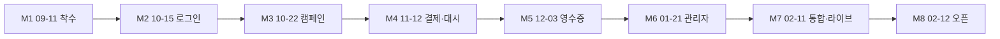

# 13. 고객 일정·마일스톤 정렬 (v7)

> **원본:** [reference/YWAMKoreaFund_세부일정_마일스톤_v7.docx](./reference/YWAMKoreaFund_세부일정_마일스톤_v7.docx)  
> **작성(고객 문서):** 2026-08 · 개발사 JIOS · 운영 사단법인 예수전도단  
> **본 문서 반영일:** 2026-08-09  
> **역할:** 고객 계약 일정(M1~M8) ↔ 내부 Phase/D-단계 매핑 · **범위 확정·미결** SSOT

---

## 0. 한눈에 보기

| 항목 | v7 확정 |
|------|---------|
| 서비스명 / 도메인 | **YWAMKoreaFund** · `ywamkoreafund.org` |
| 착수 (M1) | **2026-09-11** |
| 정식 오픈 (M8) | **2027-02-12** |
| 총 기간 | 약 **22주** |
| 총 개발비 (제안) | **USD $35,000** (계약금 30% / 중도금 40%@M5 / 잔금 30%@M8) |
| 결제 | **토스페이먼츠** (카드·계좌 자동결제 · 정기·환불). 카카오페이 등 간편결제는 수단별 정기 지원 확인 후 |
| Auth | **카카오 + 구글** OAuth |
| DB | **Supabase** (운영 비용 문서에 명시). 앱 Auth는 Better Auth 유지(내부 [10](./10_I18N_DB_PAYMENTS.md)) |
| 인력 모델 | 개발1 · 개발2 · 테스터 · PM |

**사전 구현(2026-07~08):** D0·D1 핵심(i18n · Supabase 연결 · mock create→approve→`/m/[slug]`)은 **착수 전 선행**. 정식 일정 카운트는 **M1(2026-09-11)** 부터.

---

## 1. 고객 답변 → 개발 범위 (v7 §1)

### 1.1 반영 확정

| 주제 | 확정 내용 | 내부 반영 |
|------|-----------|-----------|
| 구글 로그인 | 카카오 + **구글** 추가 | D2 Auth · [01](./01_TECH_STACK.md) · Q-10 해소 |
| 간편결제 | 카카오페이 등 **가능** · 정기 지원은 수단별 확인 | Toss 1차 · 간편결제는 계약/수단 확인 후 |
| 후원자 PII | 선교사: **이름·금액**만. 익명 시 이름 숨김. **전화·이메일 비공개**. 소식=앱 내 메시지 | T-05 ✅ · 메시지 D3 |
| 직접 송금 | **1차 범위 제외** (회계팀 별도 처리) | Phase 1 제외 · Phase 2 재검토 |
| AI 아동 캐릭터화 | 기술 가능 · **건당 비용 · 별도 협의** | Phase 1 제외 · 부가 트랙 |
| AI 자동번역 | 가능 · 참고용 권장 · 사용량 과금 · 별도 협의 | Phase 1 제외 · T-08 부가 트랙 |

### 1.2 ★ 추가 확인 필요 (범위 미확정)

| 주제 | 상태 | 액션 |
|------|------|------|
| 선교사 기준 영수증 | 필요는 확인 · **문서 종류 미정** | [07](./07_CUSTOMER_QUESTIONS.md) Q-NEW / 방문 미팅 |
| “프로젝트” vs 개인 캠페인 · 사역 분야 카테고리 | 필요는 확인 · **정의 미정** | Q-36 재오픈 · 데이터모델 보류 |

⚠ 위 2건은 답변 전까지 스키마·UI를 **과도 설계하지 않음**. 기본 캠페인(개인 미션) + 후원자 영수증으로 Phase 1 진행.

---

## 2. 관리자 기능 8영역 (v7 §2) ↔ 내부 단계

| # | 영역 | 내부 Phase / D |
|---|------|----------------|
| 1 | 승인 워크플로 (본부·선교본부 **2단계**, SLA) | 1A/1D · D2~D3 (기존 UI 다단계 mock → DB) |
| 2 | 세계지도 | 1D · D3 |
| 3 | 모금 집계·Excel/CSV | 1D · D3 |
| 4 | 사용자·권한·캠페인 한도 | 1D · D2-D / D3 |
| 5 | 결제 실패·환불 모니터링 | 1B/1D · D2-C / D3 |
| 6 | 시스템 설정 (단체·영수증 템플릿·한도) | 1D · D3 |
| 7 | 감사 로그 | 1D · D3 |
| 8 | 관리자 계정 권한 분리 (본부 / 선교본부) | 1D · D2 roles 확장 |

---

## 3. 캘린더 단계 (v7 §5) ↔ Phase / D / 마일스톤

| v7 단계 | 기간 | 담당 | 내부 Phase | D-단계 | 고객 마일스톤 |
|---------|------|------|------------|--------|---------------|
| **0. 준비** | 2026-09-11 ~ 09-24 | 전체 | Phase 0 잔여 · 계약 준비 | D0 완료분 활용 + 명단·양식·Toss 가맹 | **M1** 09-11 착수 |
| **① 인증·가입** | 09-25 ~ 10-15 | 개발1 | 0 잔여 + Auth | **D2-A** (+ Google) | **M2** 10-15 로그인 데모 |
| **② 캠페인 등록·승인** | 09-25 ~ 10-22 | 개발2 | 1A | **D2-B** (+ 아동보호 동의) | **M3** 10-22 캠페인 데모 |
| **③ 결제 연동** | 10-16 ~ 11-12 | 개발1 | 1B | **D2-C** Toss | **M4** 11-12 (결제+대시) |
| **④ 대시보드** | 10-23 ~ 11-12 | 개발2 | 1B UX | **D2-D** | **M4** |
| **⑤ 영수증·홈택스** | 11-13 ~ 12-03 | 개발1 | 1C | **D3** (회계 검수 핵심) | **M5** 12-03 |
| **⑥-A 관리자(결제·감사·설정)** | 12-04 ~ 2027-01-21 | 개발1 | 1D | D3~D4 | **M6** 01-21 |
| **⑥-B 관리자(승인·지도·리포트·권한)** | 11-13 ~ 2027-01-21 | 개발2 | 1D | D3~D4 | **M6** |
| 기능별 테스트 | 10-02 ~ 2027-01-21 | 테스터 | — | 병행 | — |
| 통합·법률·라이브 | 2027-01-22 ~ 02-11 | 전체 | 1E (+1F 압축) | **D4** | **M7** 02-11 |
| **정식 오픈** | 2027-02-12 | 전체 | 오픈 | — | **M8** |

**내부 D0~D1:** 착수 전 완료 → M1 준비 기간을 **요구사항·명단·국세청 양식·Toss 가맹·프로덕션 ENV**에 집중.

---

## 4. 지급 일정 (v7 §7) — 참고

| 구분 | 시점 | 비율 | 금액 |
|------|------|------|------|
| 계약금 | M1 2026-09-11 | 30% | $10,500 |
| 중도금 | M5 2026-12-03 | 40% | $14,000 |
| 잔금 | M8 2027-02-12 | 30% | $10,500 |

※ 제안서 수치. 최종 계약액은 방문 미팅 후 확정.

---

## 5. 일정 리스크 (v7 §9)

| 리스크 | 영향 단계 | 필요 조치 |
|--------|-----------|-----------|
| 국세청 제출 파일 양식 미확보 | ⑤ / M5 | 회계 양식 조기 수령 |
| 선교사·간사 명단 미확보 | ① / M2 | 명단 파일 조기 수령 |
| AI 부가기능 비용 미확정 | 부가 트랙 | 별도 협의 — 본선 일정 비포함 |
| Toss 라이브 심사 지연 | 통합 / M7 | 사업자 서류 준비 단계 확보 |
| 약관 검토 지연 | 통합 / M7 | 검토 담당자 준비 단계 지정 |

---

## 6. 기존 내부 문서와의 차이 (정렬 요약)

| 기존(내부) | v7 | 조치 |
|------------|-----|------|
| Auth = Kakao만 | Kakao + **Google** | ✅ 반영 |
| 승인 기본 1단계 | 본부·선교본부 **2단계** + 1주 SLA | ✅ 1A/1D·D2 목표로 상향 |
| Phase 합계 ~12–17주 | 계약 **~22주** (2026-09-11~2027-02-12) | ✅ 05에 캘린더 추가 |
| 도메인 미정 | `ywamkoreafund.org` | ✅ README·07 |
| 직접 송금 미언급 | **1차 제외** | ✅ 명시 |
| 자동번역 Phase 2 후보 | 부가·과금 트랙 | ✅ Phase 1 제외 유지 |
| Supabase Auth 미사용 | 운영비에 “DB·인증·스토리지” 표기 | 내부는 **Postgres(+Storage)** 만 · Auth=Better Auth (변경 없음, 비용 문서 해석 주의) |

---

## 7. 관련 문서

| 문서 | 역할 |
|------|------|
| [05](./05_PHASE_ROADMAP.md) | Phase + **고객 캘린더** |
| [09](./09_DEVELOPMENT_PHASES.md) | D0~D5 작업 ID |
| [07](./07_CUSTOMER_QUESTIONS.md) | 고객 Q · v7 답변 반영 |
| [06](./06_OPEN_QUESTIONS.md) | 팀 결정 · ★ 미결 |
| [11](./11_DEV_PREPARATION.md) | M1 전 준비물 |
