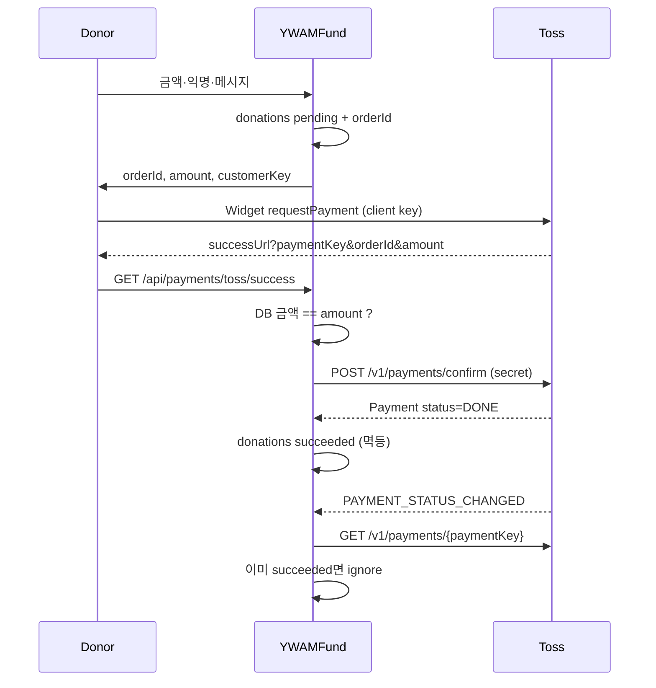
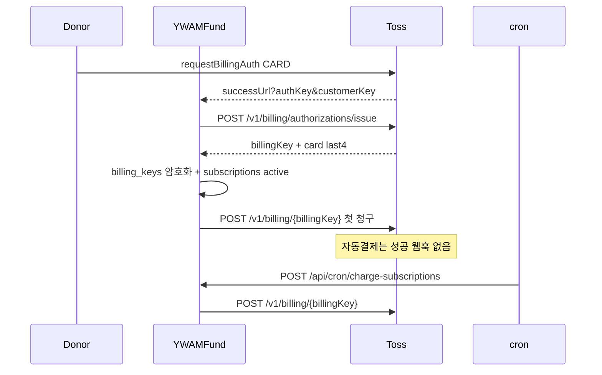

# 15. Toss PG 단계별 개발 가이드

> **목적:** YWAMFund **실결제**를 테스트 → 정기 → 환불 → 정산 → 라이브 순으로 구현하기 위한 개발 SSOT  
> **PG:** 토스페이먼츠 Phase 1 유일 (`PAYMENT_PROVIDERS_ENABLED=toss`)  
> **스택:** Next.js 16 App Router · TypeScript · Drizzle · Supabase · **SDK V2**  
> **작성:** 2026-08-15  
> **독자:** 결제 구현 담당  
> **일정:** 고객 캘린더 **③ 결제 연동 10-16 ~ 11-12 → M4** = 내부 **D2-C** ([13](./13_CUSTOMER_SCHEDULE_MILESTONE_v7.md))

---

## 0. 이 문서의 역할

| 문서 | 역할 |
|------|------|
| [YWAMFund_PG_분석_연동가이드.docx](./YWAMFund_PG_분석_연동가이드.docx) | PG 비교·선정 근거 · 초기 아키텍처 (2026-07-16). **코드 예시는 V1·웹훅 HMAC이 구식** — §12 |
| [https://docs.tosspayments.com/reference](https://docs.tosspayments.com/reference) | **코어 API 스펙** (Payment / Billing / Cancel / Query / Settlement) |
| [웹훅 이벤트](https://docs.tosspayments.com/reference/using-api/webhook-events) | 이벤트 타입 · 검증 방식 |
| [LLM Quick Reference](https://docs.tosspayments.com/guides/v2/get-started/llms-quick-reference) | V2 연동 가드레일 |
| [10](./10_I18N_DB_PAYMENTS.md) | Toss 확정 Decision Log |
| [09](./09_DEVELOPMENT_PHASES.md) D2-C | 작업 ID |
| **본 문서 (`15`)** | **구현 순서 · API 계약 · DoD · 하지 말 것** |

스펙·필드가 바뀌면 **공식 레퍼런스가 우선**이다. 수수료·심사·정산 주기는 계약서 기준.

---

## 1. 확정과 범위

### 1.1 이미 확정

| 항목 | 결정 |
|------|------|
| PG | Toss only. Stripe는 D5 stub (`PAYMENT_PROVIDERS_ENABLED=toss`) |
| 통화 | KRW 단일 |
| 일시후원 | 결제위젯(V2) → 서버 confirm → 웹훅 재조회 |
| 정기후원 | SDK `requestBillingAuth` → 빌링키 발급 → cron `POST /v1/billing/{billingKey}` |
| 원장 | 단일 `donations` + `pg_provider` |
| 실패 정책 | 연속 3회(약 3일 간격) → `subscriptions.status = paused` + 이메일 |
| 첫 정기 청구 | 등록 즉시 1회 + 익월부터 정기 (T-06 기본안) |

### 1.2 Phase 1에서 한다

- 카드 일시결제 (국내 + 계약 시 해외카드)
- 카드 자동결제(빌링)
- 서버 승인 · 웹훅 멱등 · 관리자 재처리
- 전액/부분 환불 (`cancel`)
- 정산 대사 (`/v1/settlements` · D3)

### 1.3 Phase 1에서 하지 않는다

| 제외 | 이유 |
|------|------|
| 카드번호 직접 결제 (`/v1/payments/key-in`) | 추가 계약 + PCI. 카드번호 서버 경유 금지 |
| 카드정보로 빌링키 발급 (`/v1/billing/authorizations/card`) | 동일. SDK 인증만 사용 |
| 브랜드페이 · 링크페이 · ARS | 제품 범위 밖 |
| 가상계좌 1차 필수 | 입금 비동기(`DEPOSIT_CALLBACK`). 필요 시 PG-2 이후 옵션 |
| Stripe 라이브 | D5 |
| 카카오페이 단독 계약 | Toss 위젯 수단으로만 검토. 테스트 MID 계약 필요 |

---

## 2. 단계 한눈에

```text
PG-0 준비 ──► PG-1 원장·Provider ──► PG-2 일시후원 ──► PG-3 정기후원
                                                          │
                     PG-6 라이브 ◄── PG-5 정산대사 ◄── PG-4 환불·관리
```

| 단계 | 목표 | 내부 ID | 고객 | 예상 |
|------|------|---------|------|------|
| **PG-0** | 키·ENV·스키마·웹훅 URL | D2-0-2 · 11 T1~T5 | 테스트 상점 | 2~3일 |
| **PG-1** | `PaymentProvider` + pending 주문 | D2-C0 · C3 · C8 | — | 2~3일 |
| **PG-2** | 테스트 일시후원 E2E | D2-C1 · C2 · C6 · C7 | M4 핵심 | 4~5일 |
| **PG-3** | 빌링키 · cron · 3회 실패 | D2-C4 · C5 | M4 | 4~5일 |
| **PG-4** | 환불 · 웹훅 재처리 콘솔 | D2-C9 · D3-9 | M4~M6 | 2~3일 |
| **PG-5** | 정산 대사 cron | D3-10 | M6 | 2일 |
| **PG-6** | 라이브 키 · 소액 실결제 | D4-4 | M7 | 심사 의존 |

**블로커:** 테스트 키 없으면 PG-2 불가. 빌링 상품 미개통이면 PG-3 불가. 라이브 심사·정산 계좌 없으면 PG-6 불가 ([14](./14_CUSTOMER_INFO_REQUEST.md) §2).

---

## 3. 공식 API 맵 (쓰는 것만)

Base: `https://api.tosspayments.com`  
인증: `Authorization: Basic base64(TOSS_SECRET_KEY + ":")` — **콜론 필수**  
SDK: `https://js.tosspayments.com/v2/standard` · npm `@tosspayments/tosspayments-sdk`  
문서: [코어 API](https://docs.tosspayments.com/reference)

| 용도 | Method | Path | 단계 |
|------|--------|------|------|
| 결제 승인 | POST | `/v1/payments/confirm` | PG-2 |
| paymentKey 조회 | GET | `/v1/payments/{paymentKey}` | PG-2 웹훅 검증 |
| orderId 조회 | GET | `/v1/payments/orders/{orderId}` | 장애 복구 |
| 결제 취소 | POST | `/v1/payments/{paymentKey}/cancel` | PG-4 |
| 빌링키 발급 | POST | `/v1/billing/authorizations/issue` | PG-3 |
| 자동결제 승인 | POST | `/v1/billing/{billingKey}` | PG-3 |
| 빌링키 삭제 | DELETE | `/v1/billing/{billingKey}` | PG-3 해지 |
| 거래 조회 | GET | `/v1/transactions` | PG-5 보조 |
| 정산 조회 | GET | `/v1/settlements` | PG-5 |

**POST에는 `Idempotency-Key` (UUID v4) 권장.** 15일간 동일 키 = 첫 응답 재사용. 취소·정기청구는 필수에 가깝다.

### 3.1 타임아웃

| API | 제한 |
|-----|------|
| 결제창 인증 | 30분 미인증 → `EXPIRED` |
| confirm | 인증 후 **10분** 미호출 → `EXPIRED` |
| 자동결제 승인 | 최대 60초. 클라이언트 timeout ≥ 60s |
| 거래 조회 | 최대 60초. 과다 호출 시 429 |

### 3.2 Payment.status → `donations.status`

| Toss | 우리 | 의미 |
|------|------|------|
| `READY` / `IN_PROGRESS` | `pending` | 인증 전·승인 대기 |
| `WAITING_FOR_DEPOSIT` | `pending` | 가상계좌만. Phase 1 기본 경로 아님 |
| `DONE` | `succeeded` | **유일한 성공 확정** |
| `CANCELED` | `canceled` | 전액 취소 |
| `PARTIAL_CANCELED` | `succeeded` + `refunds` | 잔액은 `balanceAmount` |
| `ABORTED` / `EXPIRED` | `failed` | 승인 실패·만료 |

전이는 **단방향**. 이미 `succeeded`면 웹훅/리다이렉트 재수신은 로그만.

---

## 4. 식별자 규칙

| 값 | 발급 | 형식 | 저장 |
|----|------|------|------|
| `orderId` | 우리 | 6~64자 `[A-Za-z0-9_-]`. 주문마다 고유 | `donations.pg_order_id` **UNIQUE** |
| `paymentKey` | Toss | 최대 200자. 상태 바뀌어도 유지 | `donations.pg_payment_key` |
| `customerKey` | 우리 | 2~50자, `-_=.@` 중 **1개 이상**. **UUID 권장** | `billing_keys.customer_key` |
| `billingKey` | Toss | 최대 200자 | `billing_keys.billing_key` **암호화** |
| `transactionKey` | Toss | 승인/취소 건 구분 | `pg_raw` / `refunds.pg_refund_key` |

**채번 예**

```text
일시   YF-OT-{uuid}          예: YF-OT-7c2a1b9e-4d3f-4a11-9c0e-1f2a3b4c5d6e
정기   YF-SUB-{subId}-{yyyyMM}  예: YF-SUB-a1b2c3d4-202611
환불   Idempotency-Key = refunds.id
```

**금지:** `customerKey`에 user id · 이메일 · 전화번호. 유추 가능하면 타인 청구에 악용된다.

반드시 저장: `orderId`, `paymentKey`. 결제 조회·취소·대사에 둘 다 필요하다.

---

## 5. 아키텍처

### 5.1 일시후원



1. `createDonationOrder` — `status=pending`, 서버가 정한 `amount_krw`만 신뢰  
2. 클라이언트 위젯 — `amount`는 서버 값. 콘솔 변조 가능 → confirm 전 재대조  
3. `successUrl`의 `amount`를 confirm에 **그대로 넣지 말 것**. DB 금액 사용  
4. confirm 성공과 웹훅이 둘 다 `succeeded`로 수렴. `pg_order_id` 조건부 UPDATE  
5. `failUrl` — confirm 호출 금지. `code`/`message`로 재시도 UI

### 5.2 정기후원



- 빌링 청구는 **서버 전용**. `requestPayment` / confirm 경로를 쓰지 않는다.  
- 성공 웹훅이 **오지 않는다**. cron 응답 + 필요 시 `GET /v1/payments/orders/{orderId}`로 확정.  
- 해지: `DELETE /v1/billing/{billingKey}` + `BILLING_DELETED` 웹훅 수신 시 키 폐기.

### 5.3 웹훅

일반 결제 웹훅(`PAYMENT_STATUS_CHANGED` 등)에는 **서명 헤더가 없다.**  
`toss-signature` HMAC은 **구 가이드 오류**. 지급대행(`payout.changed`)만 `tosspayments-webhook-signature`.

**검증:** `paymentKey`로 `GET /v1/payments/{paymentKey}` 재조회 후 그 상태로만 원장 갱신.

멱등 키: 헤더 `tosspayments-webhook-transmission-id` 또는 `eventType + paymentKey + status`.  
`webhook_events` UNIQUE(`provider`, `idempotency_key`).

등록할 이벤트 (Phase 1)

| 이벤트 | 용도 |
|--------|------|
| `PAYMENT_STATUS_CHANGED` | 일시결제 상태. EXPIRED/ABORTED 포함 |
| `BILLING_DELETED` | 카드사/사용자 측 빌링키 삭제 |
| `DEPOSIT_CALLBACK` | 가상계좌를 넣을 때만 |
| `CANCEL_STATUS_CHANGED` | 해외 간편결제 취소. 국내 카드는 보통 없음 |

---

## 6. 코드 배치

```text
lib/payments/
  types.ts          # PaymentProvider
  toss.ts           # TossProvider
  stripe.ts         # stub (throw / flag off)
  router.ts         # PAYMENT_PROVIDERS_ENABLED
  ids.ts            # orderId · customerKey 생성
  crypto.ts         # billing_key 암복호화
  mapStatus.ts      # Toss status → donations.status

app/api/payments/
  toss/success/route.ts
  toss/fail/route.ts
  toss/billing/success/route.ts
  webhook/route.ts

app/api/cron/
  charge-subscriptions/route.ts
  reconcile-settlements/route.ts   # PG-5

components/donation/
  DonationModal.tsx                # 기존 UX
  TossPaymentWidget.tsx            # V2 위젯 마운트
```

### 6.1 `PaymentProvider` (D2-C0)

```ts
type MoneyKrw = number // 정수 원. 소수점 없음

type PaymentProvider = {
  createOneTime(input: {
    orderId: string
    orderName: string
    amountKrw: MoneyKrw
    customerKey: string
  }): Promise<{ clientConfig: { clientKey: string; customerKey: string } }>

  confirmOneTime(input: {
    paymentKey: string
    orderId: string
    amountKrw: MoneyKrw
    idempotencyKey: string
  }): Promise<PaymentSnapshot>

  registerBilling(input: {
    authKey: string
    customerKey: string
  }): Promise<{ billingKey: string; cardLast4: string; cardBrand: string }>

  charge(input: {
    billingKey: string
    customerKey: string
    orderId: string
    orderName: string
    amountKrw: MoneyKrw
    idempotencyKey: string
  }): Promise<PaymentSnapshot>

  refund(input: {
    paymentKey: string
    cancelReason: string
    cancelAmount?: MoneyKrw
    idempotencyKey: string
  }): Promise<PaymentSnapshot>

  getPayment(paymentKey: string): Promise<PaymentSnapshot>
  getPaymentByOrderId(orderId: string): Promise<PaymentSnapshot>
  deleteBilling(billingKey: string): Promise<void>
  parseWebhook(rawBody: string, headers: Headers): Promise<WebhookEvent>
}
```

`StripeProvider`는 모든 메서드 throw. 라우터가 `toss`만 반환.

### 6.2 ENV

```bash
# 테스트(D2) — test_ 접두만. 라이브 키와 변수 분리 권장
TOSS_SECRET_KEY=test_sk_...
NEXT_PUBLIC_TOSS_CLIENT_KEY=test_ck_...
# 지급대행 쓸 때만. 일반 결제 웹훅 검증에는 쓰지 않음
TOSS_WEBHOOK_SECRET=

PAYMENT_PROVIDERS_ENABLED=toss
BILLING_KEY_ENCRYPTION_KEY=           # 32바이트. billing_keys 암호화
CRON_SECRET=
```

시크릿은 서버 전용. `NEXT_PUBLIC_*`에 `sk_` 넣지 말 것. 테스트/라이브 키를 같은 값으로 덮어쓰지 말 것.

---

## 7. 단계별 작업

### PG-0 — 준비

**선행:** Supabase `DATABASE_URL` · [03](./03_DATA_MODEL.md) 초안 · [11](./11_DEV_PREPARATION.md) T1~T5

| # | 작업 | DoD |
|---|------|-----|
| 0.1 | Toss 개발자센터 테스트 상점 · Client/Secret | `test_ck_` / `test_sk_` 시크릿 스토어 |
| 0.2 | 자동결제(빌링) 테스트 가능 여부 확인 | 콘솔에 빌링 메뉴/권한 |
| 0.3 | 로컬 터널 `https://…/api/payments/webhook` | ngrok / Cloudflare Tunnel |
| 0.4 | migrate: `donations` `subscriptions` `billing_keys` `webhook_events` `refunds` | UNIQUE `pg_order_id`, UNIQUE(provider, idempotency_key) |
| 0.5 | 테스트 카드 북마크 (성공/거절) | 팀 노션 또는 본 문서 부록 |

스키마 최소 컬럼은 [03](./03_DATA_MODEL.md). `pg_provider`, `pg_order_id`, `pg_payment_key`, `pg_raw`(민감필드 마스킹) 필수.

---

### PG-1 — 원장과 Provider

**선행:** PG-0.4

| # | 작업 | 대응 ID |
|---|------|---------|
| 1.1 | `lib/payments/types.ts` + `toss.ts` HTTP 헬퍼 (Basic 인증, Idempotency-Key, 에러 파싱) | D2-C0 |
| 1.2 | `stripe.ts` stub + `router.ts` | D2-C8 |
| 1.3 | Server Action `createDonationOrder` — 로그인 필수, 미션 `published`, 금액 min/max, `pending` insert | D2-C3 · C7 |
| 1.4 | `ids.ts` — orderId / customerKey 생성. donor마다 customerKey 1개 재사용 | — |
| 1.5 | 단위 테스트: 금액 불일치 confirm 거부, 중복 orderId 거부 | — |

**DoD:** DB에 pending 주문이 생기고, Toss HTTP 클라이언트가 샌드박스 `/v1/payments/{없는키}`에 401/404를 받는다 (키·인증 확인).

---

### PG-2 — 일시후원 (첫 실연동)

**선행:** PG-1 · 테스트 키

패키지: `@tosspayments/tosspayments-sdk` (V1 `@tosspayments/payment-sdk` 사용 금지)

**위젯 흐름 (V2 Payment Widget — 기본)**

1. `TossPayments(NEXT_PUBLIC_TOSS_CLIENT_KEY)`  
2. `widgets({ customerKey })`  
3. `setAmount({ value: amountKrw, currency: "KRW" })` — V2는 `updateAmount` 없음  
4. `renderPaymentMethods` · `renderAgreement`  
5. `requestPayment({ orderId, orderName, successUrl, failUrl })`

`amount`는 V2 SDK에서 `{ value, currency: "KRW" }` 객체. 서버 API의 `amount`는 **정수**.

**success 라우트**

```text
1. query: paymentKey, orderId, amount
2. donations where pg_order_id = orderId 조회
3. 없거나 pending 아니면 → 이미 succeeded면 성공 페이지, 그 외 실패
4. Number(amount) !== donation.amount_krw → confirm 금지, failed 기록
5. POST /v1/payments/confirm { paymentKey, orderId, amount: donation.amount_krw }
6. 응답 status === DONE 일 때만 succeeded + pg_payment_key + paid_at + pg_raw
7. 그 외 ABORTED 등 → failed
8. 리다이렉트 /donate/success?orderId=  (locale prefix 유지)
```

confirm 실패 시 **즉시 실패로 단정하지 말 것.** `GET /v1/payments/{paymentKey}`로 이미 `DONE`인지 확인 (네트워크 타임아웃 후 재진입).

**웹훅**

```text
1. raw body 보관 → webhook_events (received)
2. transmission-id 중복이면 200 + skip
3. PAYMENT_STATUS_CHANGED → getPayment(data.paymentKey)
4. 조회 결과로만 상태 전이
5. processed / failed
```

자동결제는 이 이벤트가 성공 시 안 온다. 일시결제 EXPIRED 처리는 여기서.

**UI**

- `DonationModal` 마지막 스텝에 위젯. 가짜 모달 제거  
- 로그인 없으면 `?next=` ([D2-C7](./09_DEVELOPMENT_PHASES.md))  
- 수수료·해외카드 고지 i18n ([D2-C6](./09_DEVELOPMENT_PHASES.md))  
- 성공 후 홈 피드·`/my`는 `succeeded`만 집계

**DoD**

- [ ] 테스트 카드 승인 → `donations.succeeded` 1건 · `paymentKey` 저장  
- [ ] 금액 변조(위젯 전 amount 변경) → confirm 거부  
- [ ] failUrl (창 닫기/거절) → pending 유지 또는 failed, confirm 0회  
- [ ] 웹훅 2회 전송 → 원장 1건, `webhook_events` 둘째 건 ignored  
- [ ] 10분 내 confirm 미호출 후 EXPIRED 웹훅 → `failed`

---

### PG-3 — 정기후원

**선행:** PG-2 DoD · 빌링 테스트 권한

| # | 작업 |
|---|------|
| 3.1 | `requestBillingAuth({ method: "CARD" })` → billing successUrl (`authKey`, `customerKey`) |
| 3.2 | `POST /v1/billing/authorizations/issue` → `billing_keys` (key 암호화, last4·brand만 평문) |
| 3.3 | `subscriptions` active, `next_charge_at` = 다음 달 동일일 (월말 28/29/30/31 보정) |
| 3.4 | 즉시 `charge` — 새 `donations` `type=recurring_charge`, 전용 `orderId` |
| 3.5 | `POST /api/cron/charge-subscriptions` + `Authorization: Bearer CRON_SECRET` |
| 3.6 | 실패: `consecutive_failures++`, +3일 재시도. 3회 → `paused` + ko/en 메일 |
| 3.7 | `/my` 해지: `deleteBilling` + subscription `canceled` |
| 3.8 | `BILLING_DELETED` → 해당 키 `status=revoked`, 구독 `paused` |

**charge 주의**

- path의 `{billingKey}`는 Toss 키. **DB uuid가 아님** (구 가이드 버그)  
- `customerKey`는 발급 때와 **동일**해야 함  
- timeout ≥ 60s  
- `Idempotency-Key` = 그날의 `orderId` (같은 달 중복 청구 방지)  
- 응답이 Payment `DONE`일 때만 succeeded. 실패 본문의 `code`/`message` 저장

**DoD**

- [ ] 빌링 등록 + 즉시 1회 청구 → donation 1건  
- [ ] cron 강제 호출 → 다음 달 orderId로 1건 더 (테스트에선 next_charge_at를 과거로)  
- [ ] 동일 Idempotency-Key 재호출 → 추가 청구 없음  
- [ ] 거절 카드 3회 → paused + 메일 키 발송  
- [ ] 해지 후 cron이 해당 구독을 건너뜀

---

### PG-4 — 환불 · 관리 콘솔

**선행:** PG-2 (PG-3는 부분환불 테스트에 유용)

```text
POST /v1/payments/{paymentKey}/cancel
{ "cancelReason": "후원자 요청", "cancelAmount": 10000 }  // 없으면 전액
Idempotency-Key: refunds.id
```

- 가상계좌가 아니면 `refundReceiveAccount` 불필요  
- 응답 `cancels[]` · `balanceAmount`로 `refunds` insert, donation은 전액이면 `refunded` / 부분이면 `succeeded` 유지  
- Admin Payments: 웹훅 `failed` 재처리, 환불 버튼(권한 `admin`), audit_logs

**DoD:** 테스트 결제 전액 취소 → Toss `CANCELED` · 우리 `refunded`. 부분 취소 → `refunds` 1행 · 잔액 일치. 같은 환불 버튼 두 번 → 1건.

---

### PG-5 — 정산 대사

**선행:** 테스트 환경에서 정산 API 응답 확인 (라이브와 데이터가 다를 수 있음)

```text
GET /v1/settlements?startDate=...&endDate=...
GET /v1/transactions?startDate=...&endDate=...   # 보조
```

일일 cron: Toss `payOutAmount` 합 ↔ 내부 `succeeded` − `refunds` 합. 불일치 시 admin 알림.  
원장 하드 삭제 금지.

**DoD:** 어제자 리포트 1장. 불일치 fixture로 알림 경로 확인.

---

### PG-6 — 라이브

**선행:** [14](./14_CUSTOMER_INFO_REQUEST.md) O1 라이브 키 · 심사 · 정산 계좌 · 약관

| # | 작업 |
|---|------|
| 6.1 | `live_sk_` / `live_ck_` 를 **별도** 프로덕션 ENV. 테스트 키와 혼용 금지 |
| 6.2 | 웹훅 URL을 프로덕션 도메인으로 재등록 |
| 6.3 | 소액(예: 100~1000원) 실카드 1회 + 환불 + 정산 계좌 입금 확인 |
| 6.4 | 정기 1건 등록 후 수동 charge 1회 (실청구) 후 즉시 해지·환불 |
| 6.5 | D4-1: 레이트리밋(Upstash) · confirm/webhook · 로그 마스킹 |

**DoD:** M7 베타 실결제 체크리스트 ([09](./09_DEVELOPMENT_PHASES.md) D4).

---

## 8. 보안 · 안정성

| 항목 | 규칙 |
|------|------|
| 금액 | 클라이언트 amount 불신. confirm/charge는 DB 금액 |
| 시크릿 | 서버만. gitignore · Vercel/Supabase secrets |
| 카드 | 번호·CVC·유효기간 저장·로그 금지. last4만 |
| 빌링키 | AES(또는 KMS) + `enc_version` |
| 웹훅 | 일반 결제는 **조회 API로 재검증**. HMAC 가정 금지 |
| 멱등 | orderId UNIQUE + Idempotency-Key + webhook transmission-id |
| cron | `CRON_SECRET`. 미인증 403 |
| 레이트리밋 | confirm · webhook · charge |
| 로그 | `pg_raw`에서 `secret`, 계좌 전문 마스킹 |
| 감사 | 상태변경·환불·해지 → `audit_logs` |
| 보존 | 결제 원장 하드 삭제 금지. 탈퇴 시 PII만 익명화 |

---

## 9. 테스트

### 9.1 샌드박스

- 키 접두 `test_*`. 실출금 없음  
- 개발자센터 테스트 카드 · 웹훅 재전송  
- 로컬은 터널 없으면 웹훅 스킵 → **조회 API로 상태 맞추는 경로**도 구현

### 9.2 E2E (Playwright, D2 후반)

| 시나리오 | 기대 |
|----------|------|
| 일시 성공 | donation succeeded, 피드·대시 반영 |
| 일시 실패/취소 | confirm 없음, 재시도 가능 |
| 금액 불일치 | 4xx, 미승인 |
| 웹훅 중복 | donation 1건 |
| 정기 등록+즉시청구 | subscription active + donation 1 |
| cron | next_charge_at 갱신 |
| 3회 실패 | paused |
| 환불 | refunds + Toss CANCELED |

### 9.3 confirm 실패 복구

네트워크 오류 후 재진입: Query API가 `DONE`이면 원장만 맞추고 재confirm하지 않음 (`ALREADY_PROCESSED_PAYMENT` 등).

---

## 10. 고객·계약 의존

개발이 막히는 항목. 회신은 [14](./14_CUSTOMER_INFO_REQUEST.md).

| 항목 | 막히는 단계 | 질문 |
|------|-------------|------|
| Toss 테스트 상점·빌링 개통 | PG-2/3 | 11 T1~T4 |
| 수수료율 · cover-fee 표시 | PG-2 UI | Q-50 |
| 해외카드 옵션 | PG-2/6 | Q-52 |
| 정산 주체·선교사 이체 | PG-5/6 | Q-55 |
| 환불 SLA | PG-4 | Q-58 |
| 라이브 심사 서류 | PG-6 | Q-01~02, Q-07, T-24 |

---

## 11. 구현 시 하지 말 것 (공식 실수 목록)

| 잘못된 패턴 | 올바른 패턴 |
|-------------|-------------|
| `Authorization: Basic base64(SECRET)` | `base64(SECRET + ":")` |
| successUrl `amount`로 confirm | DB `amount_krw`로 confirm |
| 서버 API에 client key | secret key |
| V1 `requestPayment("카드", { amount: 15000 })` | V2 `requestPayment({ amount: { value, currency: "KRW" }, ... })` |
| V2 위젯 `updateAmount` | `setAmount` |
| 일반 웹훅 HMAC `toss-signature` | `GET /v1/payments/{paymentKey}` |
| 빌링 청구에 confirm 플로우 | `POST /v1/billing/{billingKey}` |
| `customerKey` = userId/email | UUID + 특수문자 |
| `orderId`에 공백·한글 | `[A-Za-z0-9_-]` 6~64 |
| billing path에 DB id | Toss `billingKey` |
| failUrl에서 confirm | 메시지만 |
| 가상계좌 발급 응답을 성공 처리 | `DEPOSIT_CALLBACK` + 재조회 `DONE` |
| 테스트/라이브 키 한 변수에 섞기 | `test_*` / `live_*` 환경 분리 |

필드명은 레퍼런스에 있는 것만. Stripe식 `payment_intent` 등을 만들지 말 것.

---

## 12. 구 가이드(docx)와의 차이

`YWAMFund_PG_분석_연동가이드.docx`는 **선정 근거·플로우 그림**은 유효하다. 아래는 구현 시 덮어쓸 것.

| docx | 현재 공식 / 본 문서 |
|------|---------------------|
| `@tosspayments/payment-sdk` V1 | `@tosspayments/tosspayments-sdk` V2 |
| HMAC `toss-signature` + `TOSS_WEBHOOK_SECRET` | 일반 결제는 조회 API 재검증 |
| `customerKey: donorUserId` | 별도 UUID `customer_key` |
| cron path `billing/${sub.billingKeyId}` | Toss `billingKey` 문자열 |
| confirm 후 웹훅 없이 성공 확정만 | confirm + 웹훅 둘 다 멱등 수렴. 빌링은 응답만 |
| PG 미선정(비교표) | Toss 확정 (2026-07-21) |

docx §2 비교표·§3 선정 근거는 이력으로 유지. 수수료 숫자는 견적서로 교체.

---

## 13. 공식 링크

| 내용 | URL |
|------|-----|
| 코어 API | https://docs.tosspayments.com/reference |
| 웹훅 이벤트 | https://docs.tosspayments.com/reference/using-api/webhook-events |
| 웹훅 연결 | https://docs.tosspayments.com/guides/v2/webhook |
| 결제위젯 | https://docs.tosspayments.com/guides/v2/payment-widget |
| 자동결제 | https://docs.tosspayments.com/guides/v2/billing |
| 결제 취소 | https://docs.tosspayments.com/reference#결제-취소 |
| LLM 가드레일 | https://docs.tosspayments.com/guides/v2/get-started/llms-quick-reference |
| 개발자센터 | https://developers.tosspayments.com |
| 테스트 카드 | 개발자센터 샌드박스 메뉴 (번호는 콘솔 최신본) |

문서 URL 뒤에 `.md`를 붙이면 원문 마크다운 (예: `/reference.md`).

---

## 14. 다음 스프린트 체크리스트 (복사해서 사용)

```text
PG-0  [ ] 테스트 키  [ ] 빌링 권한  [ ] 웹훅 URL  [ ] migrate
PG-1  [ ] PaymentProvider  [ ] createDonationOrder  [ ] Stripe stub
PG-2  [ ] V2 위젯  [ ] confirm+금액검증  [ ] webhook 재조회  [ ] failUrl
PG-3  [ ] 빌링키 암호화  [ ] 즉시청구  [ ] cron  [ ] 3회 paused  [ ] 해지
PG-4  [ ] cancel + Idempotency-Key  [ ] Admin 재처리
PG-5  [ ] settlements cron  [ ] 불일치 알림
PG-6  [ ] live 키 분리  [ ] 소액 실결제·환불  [ ] 정산 입금
```
